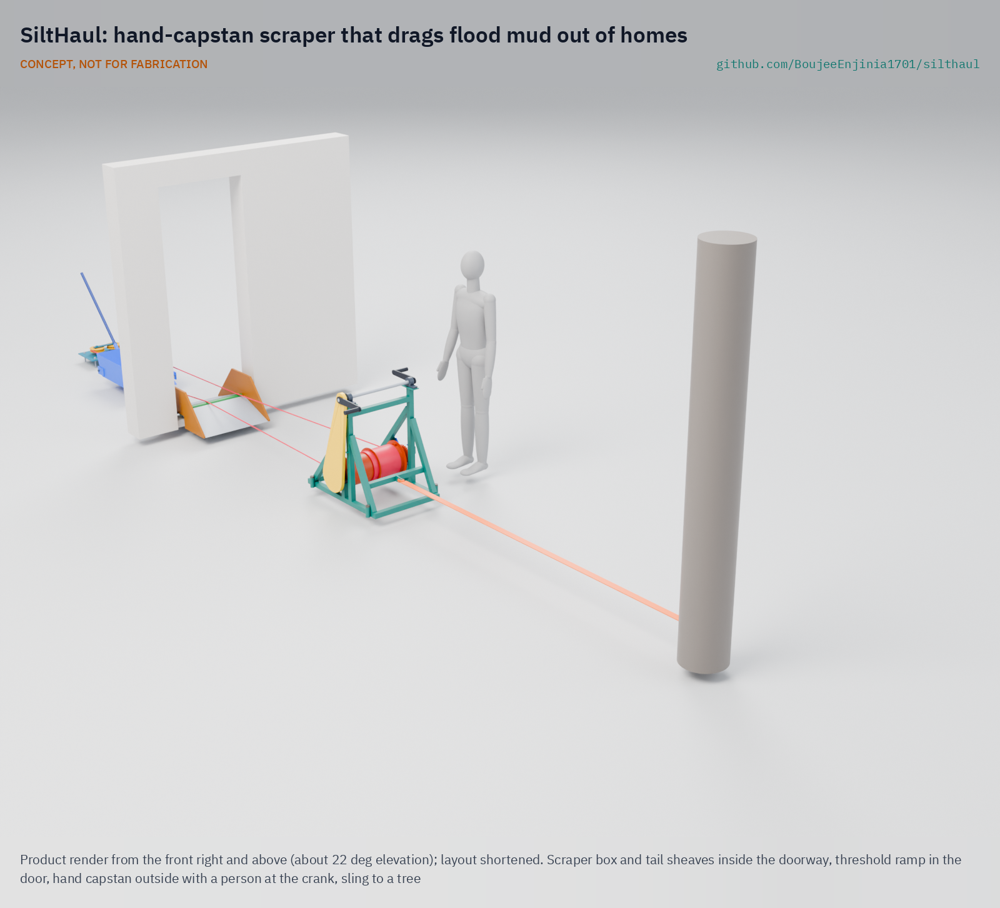
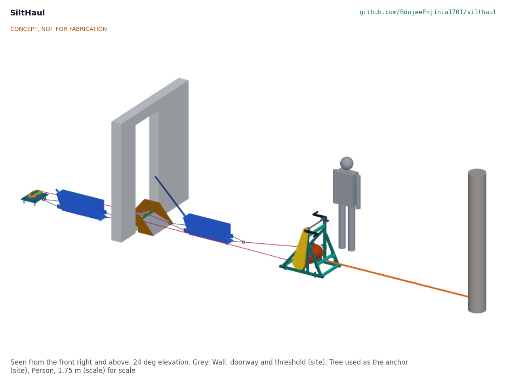
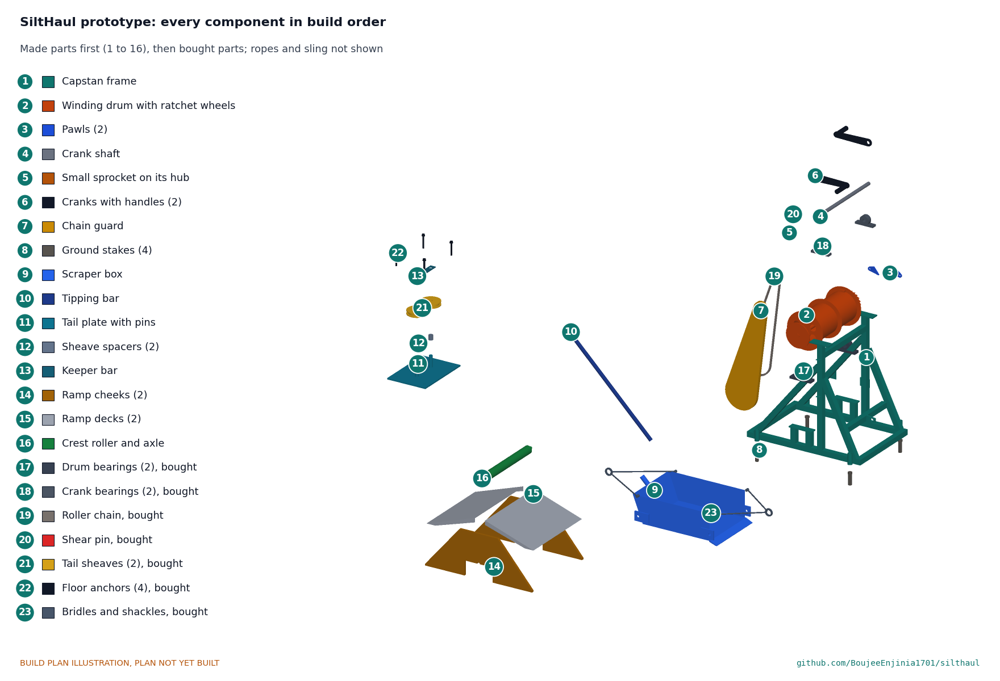

# SiltHaul

     

**Area:** Situational field hardware · **TRL:** 3 of 9 (proof of concept on paper; constructable design) · **Value-engineering target:** USD 2,000; estimated parts cost USD 887.50 · **Difficulty:** 3 of 5

Drags flood mud out of homes, lanes and drains with a hand-capstan scraper instead of shovels and buckets.

> CONCEPT, NOT FOR FABRICATION. SiltHaul is a TRL 3 design on paper: it has not been built or tested.

## Concept rationale

Mines solved a similar job a century ago with the slusher: a scraper dragged across the floor by rope and returned by a tail rope through a sheave at the far end ([Mining History Association](https://www.mininghistoryassociation.org/Journal/MHJ-v22-2015-Reynolds.pdf)). SiltHaul is a hand-powered slusher for flooded homes. A hand capstan is anchored outside the door, a tail sheave is fixed inside the room, and a rope loop runs between them to a scraper box. Crank one way and the box drags a load of mud out through the door; crank the other way and it returns for the next.

The point is to change who carries the weight. With shovels and buckets, people lift and carry every kilogram of mud. With SiltHaul, they load the box where it sits and the rope does the carrying. It uses no fuel and no power, fits through a doorway and packs into a car, so community groups and relief teams can bring it into lanes that machines cannot reach.

## Burning platform

After the 2018 Kerala floods, about 70,000 people joined a single clean-up drive in Kuttanad, aiming to clean about 100,000 buildings of silt, debris and mud across 16 panchayats ([Gulf News, 2018](https://gulfnews.com/world/asia/india/kerala-flood-70000-people-participate-in-massive-post-flood-clean-up-drive-in-kuttanad-1.2271770)). In the weeks that followed, at least 66 people died of leptospirosis ([Quartz, 2018](https://qz.com/india/1377755/after-kerala-floods-leptospirosis-has-killed-nearly-70-in-india)), and the state health department told everyone engaged in cleaning after the flood to take preventive medicine ([Mongabay, 2018](https://india.mongabay.com/2018/09/leptospirosis-outbreak-causes-concern-in-kerala-after-the-floods/)).

The pattern repeats wherever floods reach homes. In Valencia in 2024, thousands of volunteers self-organised to clear mud and debris after floods that killed at least 232 people ([Wikipedia](https://en.wikipedia.org/wiki/2024_Spanish_floods)). OSHA warns that flood clean-up workers risk back, knee and shoulder injuries from manual lifting and handling, and faces biological hazards from sewage and other contamination in floodwater ([OSHA](https://www.osha.gov/flood/response)).

## Where it could be used

### By industry

| Industry | Use |
| --- | --- |
| Disaster relief and humanitarian response | Mud clearance kits for volunteer and NGO clean-up teams |
| Municipal services | Clearing silted drains, culverts and narrow lanes without heavy plant |
| Civil protection and volunteer fire services | Pre-positioned flood recovery equipment |
| Housing and restoration contractors | Mucking out ground floors and basements where machines cannot enter |
| Agriculture | Clearing silt from farm buildings, sheds and small channels after floods |

### By country or region

| Country or region | Why it matters there |
| --- | --- |
| India | About 70,000 volunteers turned out to clean about 100,000 buildings in Kuttanad after the 2018 Kerala floods ([Gulf News, 2018](https://gulfnews.com/world/asia/india/kerala-flood-70000-people-participate-in-massive-post-flood-clean-up-drive-in-kuttanad-1.2271770)). |
| Pakistan | The 2022 floods affected 33 million people and caused USD 5.6 billion of damage to housing ([ReliefWeb, PDNA](https://reliefweb.int/report/pakistan/pakistan-floods-2022-post-disaster-needs-assessment)). |
| Spain | After the 2024 Valencia floods, thousands of volunteers self-organised to clean mud and debris from affected towns ([Wikipedia](https://en.wikipedia.org/wiki/2024_Spanish_floods)). |
| Germany | In the Ahr valley in 2021, about 3,000 of 4,200 buildings along the river were damaged, and clean-up was still running six months later ([deutschland.de](https://www.deutschland.de/en/topic/environment/catastrophic-flooding-in-germany-rebuilding-in-the-ahr-valley)). |

## What sparked the idea

The idea came from the scale of the 2018 Kerala clean-up. In Kuttanad, about 70,000 people, from as far as Kannur district, came together to clear silt and mud from about 100,000 buildings, and ministers warned rehabilitation could take six months to a year ([Gulf News, 2018](https://gulfnews.com/world/asia/india/kerala-flood-70000-people-participate-in-massive-post-flood-clean-up-drive-in-kuttanad-1.2271770)). That much human effort, with shovels and buckets, suggested that a simple tool which moved mud by rope rather than by arms could multiply what each volunteer can do.

## Problem

After a flood, homes, lanes and drains are left full of heavy, contaminated mud, and it is cleared almost entirely by hand with shovels and buckets. The work is slow, exhausting and puts people in long contact with dirty water and silt.

Full problem statement: [docs/01-problem.md](docs/01-problem.md)

## Concept

A scraper box hauled on a rope loop by a hand capstan anchored outside, with a tail sheave inside the room; workers crank the capstan to drag flood mud out of homes, lanes and drains instead of shoveling it into buckets.

Full design precis: [docs/02-concept.md](docs/02-concept.md) · Requirements: [docs/03-requirements.md](docs/03-requirements.md) · Calculations: [docs/04-calcs/01-sizing.md](docs/04-calcs/01-sizing.md) · Prototype build plan: [docs/05-build-plan.md](docs/05-build-plan.md) · Design decisions: [docs/06-design-decisions.md](docs/06-design-decisions.md) · [3D viewer](media/viewer.html)

On paper (SLH-CAL-001): two boxes ride on the rope loop, so every stroke hauls a full 40 L box out while the other goes back to be filled. Two people at the cranks need 63 N each; a shear pin caps the rope tension at about 2.5 kN; the frame packs flat and the heaviest lift is 23.1 kg. It moves about 0.51 m³ an hour with a crew of four and a rest allowance, 0.57 times what the same crew moves with buckets, and nobody lifts or carries mud. Requirement R1, as Amish restated it (at least 0.5 times the bucket crew), is met on paper.

## Key components

- Hand capstan: a split winding drum, 4:1 chain drive, two cranks, shear pin and two ratchet wheels with pawls
- Outside anchor set: round sling to a tree or vehicle, four ground stakes
- Tail sheave block: two sheaves on a floor plate held by four M12 anchors
- Rope loop: 10 mm polyester pull rope and return rope
- Two scraper boxes: 210 mm wide, 40 L each, one on each rope, open toward the door, with bridles and a shared tipping bar
- Doorway rope guard: threshold ramp with a crest roller
- Stop signal and briefing card

## Building the prototype

The build plan takes a capable maker from stock steel tube, plate and sheet to a working prototype in thirteen illustrated steps, with a making sketch for each made part and close-ups of every joint that needs one. The flat-pack capstan frame, drum, two boxes, tail plate and ramp are welded or bolted from stock; the bearings, sprockets, chain, sheaves, anchors, rope and lifting gear are bought. It is a plan, not yet built; building and testing to it is TRL 4 work. See [docs/05-build-plan.md](docs/05-build-plan.md).

## Safety

> Published as an open engineering reference, not certified equipment. Users are responsible for their own risk assessment.
>
> This is a rope-and-anchor system under tension: a failed anchor or rope can whip. Nobody stands in the line of the rope or beside the sheave while cranking.
>
> All anchors, sheaves and ropes must be proof-loaded before use and inspected each day.
>
> The chain drive is fully guarded and a 4 mm shear pin limits the rope tension; never run without the guard or replace the pin with a stronger one. Choose a pawl before letting go of the cranks; two people tip the box, only with a pawl holding.
>
> The tail sheave block is anchored only to a sound concrete slab, never to walls or door frames; the capstan sling runs level or rises 10 degrees at most.
>
> Check the building for structural damage and switch off electricity before work starts.
>
> Flood mud may carry sewage and disease; users need boots, gloves and hygiene measures, and should follow local health advice.
>
> This design is published as an open engineering reference. It is not certified equipment. TRL 3 concept, not released for fabrication.

## Repository layout

| Folder | Contents |
| --- | --- |
| `docs/` | Problem, concept, requirements, calculations and design decisions |
| `cad/src/` | build123d Python source, the source of truth for all geometry |
| `cad/step/`, `cad/stl/` | Exported models for FreeCAD, other CAD tools and printing |
| `cad/drawings/` | 2D sketches and dimensioned drawings |
| `bom/` | Bill of materials |
| `electronics/` | KiCad schematics and PCB layouts |
| `firmware/` | Microcontroller code |
| `media/` | Renders, perspectives and photos |
| `build-log/` | Dated prototyping notes |

## Documentation

Controlled documents follow the portfolio [documentation standard](.kit/STANDARDS.md). Each carries a document ID (SLH-PRC-001 for the precis), a version and a revision history. Branded PDFs are built with `python .kit/render.py` and attached to GitHub Releases when a document is tagged, for example `SLH-PRC-001/v1.0`.

## Credits

Designed by Amish Chadha at Design Molecule Labs. See [CONTRIBUTORS.md](CONTRIBUTORS.md) for roles. To cite this design, use [CITATION.cff](CITATION.cff) (GitHub shows it as "Cite this repository").

AI assistance (Claude) was used to accelerate prototype documentation and first-pass research. Design direction and all decisions are Amish Chadha's, recorded in this repository's decision records (`docs/decisions/`).

## Licenses

- **Hardware** (CAD, drawings, BOM, electronics): [CERN-OHL-S v2](LICENSE)
- **Software** (firmware, scripts, notebooks): [MIT](LICENSE-SOFTWARE)

A project of the [Design Molecule](https://designmolecule.com) lab.
