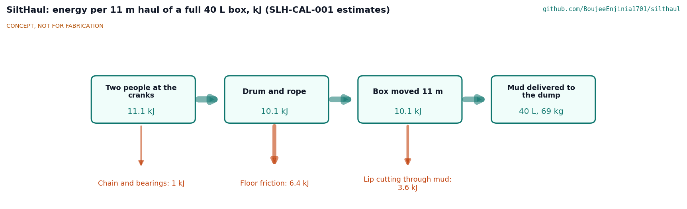

# SiltHaul design precis

Drags flood mud out of homes, lanes and drains with a hand-capstan scraper instead of shovels and buckets.

*Figure 1. Concept render: tail sheave block and scraper box in the room, ramp in the doorway, hand capstan outside with a sling to a tree (layout shortened).*

## Summary

SiltHaul is a hand-powered slusher for flooded buildings. A steel scraper box, 450 mm wide and holding about 40 L, is tied into a rope loop that runs from a hand capstan outside, through the doorway, round a tail sheave block anchored to the floor at the far end of the room, and back. Cranking one way drags the loaded box out through the door to a dump point; cranking the other way brings it back. Two people at the cranks need 63 N each; nobody lifts or carries mud out of the building. The design is constructable (SLH-DDR-002), its parts cost about USD 888 against a USD 2,000 value-engineering target, and its heaviest lift is 24.7 kg. On paper it moves about 0.32 m³ an hour with a crew of four, about a third of a bucket crew, so it trades output for the end of lifting and carrying (SLH-CAL-001).

## How it works

1. **Set up.** The capstan stands outside, at least 6 m beyond the door and in line with it, held back by a round sling to a tree or a parked vehicle and kept from skating by four stakes. The tail sheave block is bolted to the concrete floor at the far end of the room with four M12 anchors. A ramp straddles the threshold.
2. **The loop.** The pull rope runs from the lower side of the drum's pull half, over the ramp roller, to the box's front bridle. The return rope runs from the box's rear bridle to the tail block, round its two sheaves and back beside the box, 300 mm to one side, over the ramp roller to the top of the drum's return half.
3. **Haul.** Cranking winds the pull rope onto one half of the drum while the other half pays out the return rope at the same rate, so the loop stays the same length. The box's open front, which faces the door, scoops mud as it goes; workers also shovel or push mud into it.
4. **Dump.** The box stops at a dump point outside. A pawl holds the drum. Two people lift the loose tipping bar, which drops into a socket on the back, and the box rolls forward over its lip and empties.
5. **Return.** The other pawl is chosen and the cranks turned the other way. The sloped back rides over the mud as the empty box is pulled back.

## Main components

*Table 1. Components (numbers are BOM lines).*

| # | Component | What it is |
| --- | --- | --- |
| 1 | Capstan frame | Welded 40 mm square tube, 890 x 663 x 814 mm, 24.7 kg, with bearing pads, an anchor bar and eye at drum height, stake tubes and pawl brackets |
| 2 | Winding drum | 219.1 mm tube in two halves of 21 turns each, on a 30 mm shaft, with a 48-tooth sprocket and two opposite ratchet wheels; 19.0 kg |
| 3, 4 | Bearings | UCP206 pillow blocks for the drum, UCP205 for the crank shaft |
| 5 | Crank shaft and cranks | 25 mm shaft 850 mm up, two 250 mm cranks set 180 degrees apart |
| 6, 7 | Chain drive | ISO 08B-1 chain, 12 to 48 teeth, 4:1 |
| 8 | Pawls | Two, one for each direction |
| 9 | Chain guard | Closed 1.5 mm sheet guard round the chain and sprockets |
| 10 | Shear pin | 4 mm S235 pin in the small sprocket hub; limits rope tension to about 2.5 kN |
| 11, 12 | Outside anchor set | Four stakes and a 2,000 kg round sling with shackles |
| 13 to 15 | Tail sheave block | 10 mm floor plate with two 125 mm sheaves on 25 mm pins, a keeper bar and four M12 floor anchors |
| 16 | Ropes | 10 mm polyester double braid, 18 kN: a 17 m pull rope and a 38 m return rope |
| 17, 18, 20 | Scraper box | 2 mm steel box with a bevelled lip, skids, sloped back, bridle lugs, bridles and a loose tipping bar |
| 19 | Doorway ramp | Plywood cheeks, steel decks and a crest roller; fits 0.7 m doors and 110 mm thresholds |
| 22 | Stop signal and briefing card | Hand signals, whistles and the stop rule |

## Numbers from the TRL 3 calculations

*Table 2. Key figures (SLH-CAL-001).*

| Quantity | Value |
| --- | --- |
| Full box | 40.7 L, 85 kg with mud at 1.7 kg/L |
| Haul pull | 917 N estimated; 1,000 N working pull |
| Crank force | 63 N each with two people; 126 N for one |
| Rope speed | 5.4 m/min loaded, 8.1 m/min empty |
| Trip over 11 m | 5.65 min; 10.6 trips and 0.43 m³ an hour (0.32 with rest) |
| Overload limit | Shear pin releases at about 2,450 N; all parts sized on 3,000 N |
| Rope | Factor 18 on the working pull, 5.4 on the limit |
| Tail block | 0.45 of recommended anchor loads at the limit |
| Heaviest lift | Frame 24.7 kg; drum with bearings 23.1 kg |
| Cost | Value-engineering target: USD 2,000. Estimated cost of the constructable design: USD 887.50 (USD 1,112.50 under the target) |

*Figure 2. Energy for one 11 m haul of a full box (estimates): most of what the crank crew puts in goes to dragging the box over the floor.*

## Key design choices

All decided on 2026-10-03 under Amish's pre-approval (SLH-DDR-001 and SLH-DDR-002):

- **Split winding drum, not a friction capstan.** A loop on a friction drum needs a pretension of about half the pull and its turns walk along the drum. A drum whose halves wind and unwind together cannot slip and keeps the loop length constant.
- **Overload limit by shear pin.** Without it a jammed box and two people heaving could put 6.4 kN into the rope. With it every part is sized on 3,000 N.
- **Two ratchet wheels on the drum shaft.** The drum is held in either direction, even if the chain or pin fails.
- **Return leg beside the box.** The box is 450 mm wide so the box and the return leg pass a 0.7 m door together.
- **Open front facing the door.** The box scoops on the way out and keeps its load against its back; it tips forward over its lip at the dump, like a Fresno scraper.
- **Tail block on drilled floor anchors only.** No reliance on walls or door frames; a room without a sound slab is not worked with SiltHaul.
- **Sling at drum height.** The anchor eye is 200 mm up so the rope and the sling pull in line and the capstan cannot tip.

## Patent design-arounds

From the preliminary patent, trademark and prior-art screen (not legal advice):

- Slusher patents US2588657A and US3532170A have expired and are free prior art; the Fresno scraper's forward-tipping bowl is nineteenth-century prior art.
- WO2017216731A1 (Sulzer scraper winch) is shown as ceased on Google Patents; a South African family member (ZA201808475B) is listed and should be confirmed before release. SiltHaul uses a hand-cranked split drum, not motor-driven drums.
- Watch item from the preliminary screen: tail-sheave anchor on weak, wet walls. The tail block has its own floor anchors and never bears on a wall.

## Relationship to other lab projects

- **Hand capstan common block.** SiltHaul's capstan is recorded as the candidate common block for SaltDrag; SaltDrag is checked against it when it reaches TRL 3 (not edited here).
- **CalRig.** The first candidate rig for the proof loads of the anchors, rope and capstan.

## Safety

> **Safety:** Published as an open engineering reference, not certified equipment. Users are responsible for their own risk assessment.
>
> **Rope under tension.** A failed anchor, shackle or rope can whip. Nobody stands in the line of a rope, inside the loop, or beside a sheave or the ramp while the cranks turn. The shear pin limits rope tension to about 2.5 kN; never replace it with a stronger pin or a bolt.
>
> **Moving machinery.** The chain and sprockets are fully guarded; never turn the cranks with the guard off. Keep hands clear of the drum and rope where it winds on. Choose the pawl before letting go of the cranks.
>
> **Anchors.** Every anchor, the rope and the capstan are proof-loaded before first use and the rope, splices, shackles and anchors are inspected each day. The tail block is used only on a sound concrete slab; the sling runs level or rises 10 degrees at most.
>
> **Dumping.** Two people lift the tipping bar, only when the cranks are stopped and a pawl is holding.
>
> **The building and the mud.** Check the building for structural damage and switch off electricity before work starts. Flood mud may carry sewage and disease; users need boots, gloves and hygiene measures, and should follow local health advice.
>
> **Stop rule.** One signaller, a whistle and the card's hand signals. One blast stops the cranks; nobody enters the rope area until the signaller says so.

## Open questions

None for the design. Questions about mud, floors and people are for the first trials: how the box fills and drags in liquid slurry and stiff clay, how often the slab is sound enough for the tail anchors, and the real bucket-crew rate for R1.
