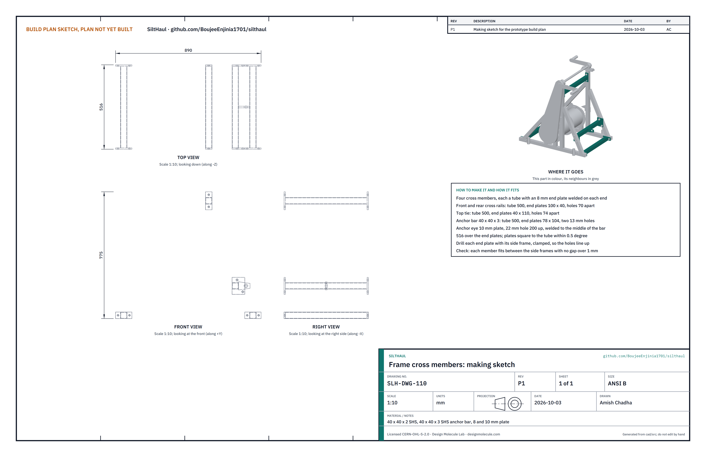
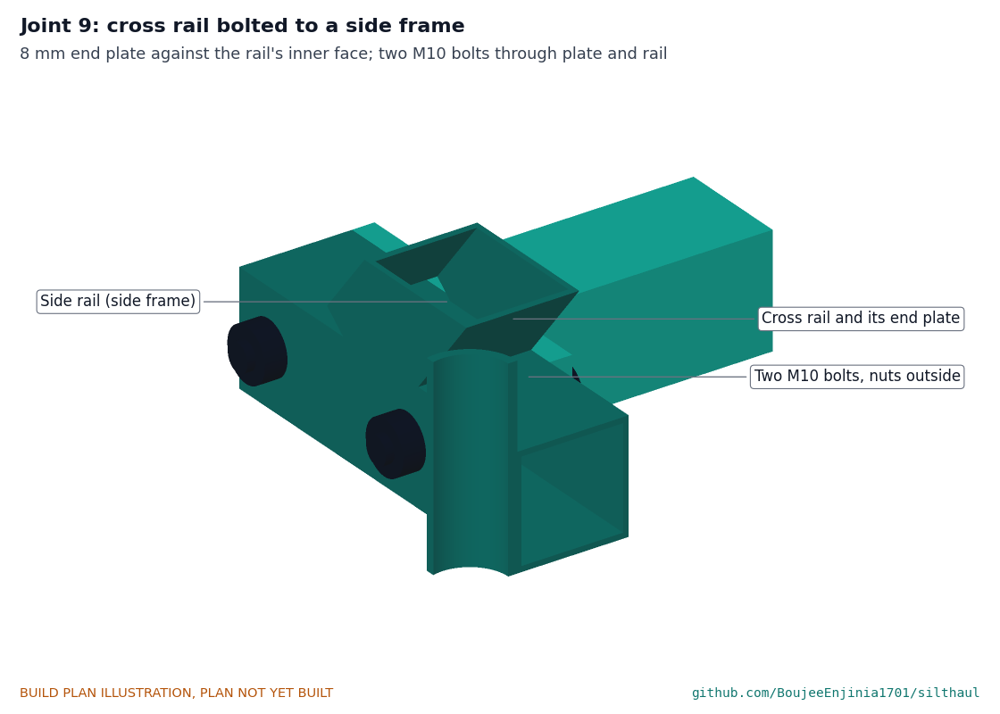
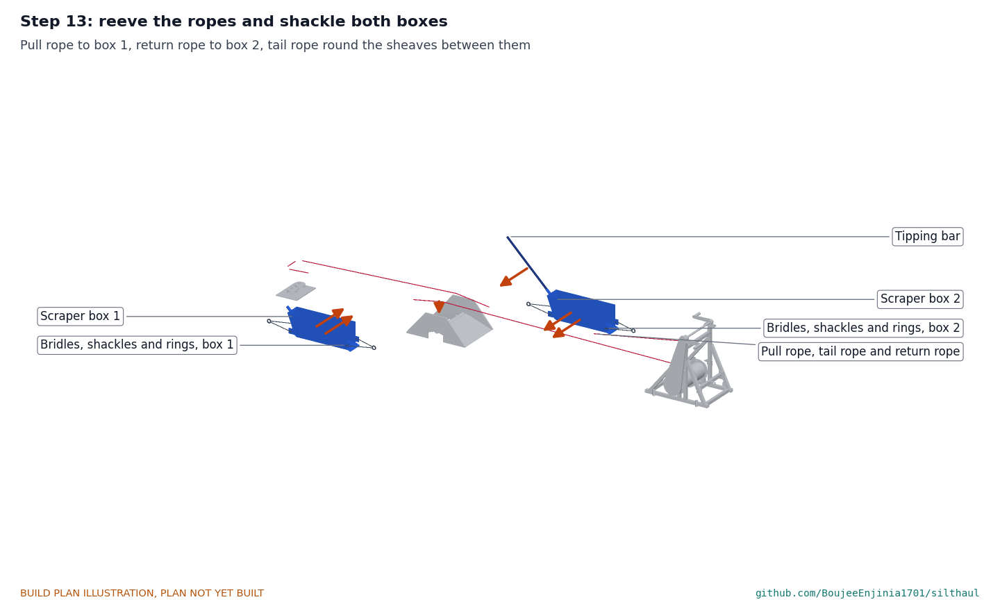

# SiltHaul prototype build plan

**Plan, not yet built.** How to build the first proof-of-concept prototype, component by component. Building and testing to it is TRL 4 work. Decisions are kept in the design decisions register ([docs/06-design-decisions.md](06-design-decisions.md)), not here.

## 1. What you are building

*Figure 1. Every component pulled apart and numbered in build order: made parts 1 to 17, bought parts 18 to 25. Only one of the two scraper boxes is shown.*

The prototype is a hand-cranked rope haul for flood mud: a capstan that stands outside, a tail sheave block bolted to the floor at the far end of the room, a ramp across the doorway threshold, two steel scraper boxes and three ropes that join them in a loop. One box rides on the pull rope and the other on the return rope, so every turn of the cranks hauls one full box out while the other goes back empty. The capstan frame packs flat: two welded side frames joined on site by four bolted cross members. You weld the side frames, the cross members, the drum, the boxes and the tail plate from stock steel tube, plate, sheet and bar; profile-cut the ratchet wheels and pawls; make the ramp from plywood and folded sheet; and buy the bearings, sprockets, chain, sheaves, anchors, shackles, bolts, sling and rope. The parts cost about USD 1,056 from the bill of materials. The work needs a MIG welder or a small stick welder, a pillar drill and hand tools.

> **Safety:** SiltHaul works with ropes and anchors under tension and a chain drive turned by hand. A failed anchor, shackle or rope can whip; the chain, sprockets, drum and cranks can trap fingers and clothing. The building work involves welding, grinding and drilling concrete. Nobody turns the cranks with the chain guard off, and nothing is loaded before the safety stops in section 6 allow it. Load tests are TRL 4 work.

## 2. What changed to make it buildable

The concept showed what SiltHaul does; some of its parts could not be made or fitted as drawn. Each change keeps what SiltHaul does and is recorded in decision record SLH-DDR-002. The last two rows came later, from Amish's decisions on the requirements, and are recorded in SLH-DDR-003.

*Table 1. Changes from the concept.*

| Component | The concept had | The buildable design has | Why |
| --- | --- | --- | --- |
| Capstan | A friction capstan with the rope loop wrapped round it | A drum in two halves: one winds the pull rope while the other pays out the return rope (Figure 5) | Cannot slip, needs no pretension, the turns cannot walk along the drum |
| Drive | Crank on the drum | 4:1 chain from a crank shaft 850 mm up, two cranks (Figure 13) | 63 N per person at the working pull |
| Overload | None | A 4 mm shear pin in the small sprocket's hub (Figure 9) | Rope tension never passes about 2.5 kN |
| Holding | One ratchet | Two opposite ratchet wheels on the drum shaft, one pawl in front and one behind (Figure 10) | Holds either way, even if the chain fails |
| Frame | 40 x 40 x 3 tube, sling at ground level | 40 x 40 x 2 tube; anchor bar and eye 200 mm up (Figure 11) | Under 25 kg; the sling pulls in line with the ropes |
| Box | Width not set; open front toward the room | 450 mm wide, open front toward the door, sloped back, lugs for bridles (Figure 15) | Box and return rope pass a 0.7 m door together; scoops going out, rides over mud coming back |
| Tail block | One sheave on a floor plate, or a door-frame bar | Two 125 mm sheaves on 25 mm pins, keeper bar, four floor anchors (Figure 17) | Bought sheaves; never bears on a wall |
| Doorway guard | Rope guard on the frame | Ramp with plywood cheeks and a crest roller (Figure 19) | Carries the boxes and the ropes over the threshold |
| Boxes | One 450 mm box; the return rope came back empty | Two boxes 210 mm wide inside and 845 mm long, one on each rope, joined by a tail rope round the tail sheaves (Figure 15) | Mud goes out on every stroke; the boxes pass each other and both fit the ramp in a 0.7 m door |
| Frame | One welded frame, 890 x 663 x 814 mm | Two welded side frames and four bolted cross members (Figures 2, 3 and 4) | Packs flat into a small car boot |

## 3. Making the components

Make and check each component before the step that needs it. Sizes are in millimetres. "Front" is the side of the capstan that faces the house; "+Y side" is the side with the ratchet wheels, "-Y side" the side with the chain. Workshop tolerance is 1 mm unless a step says otherwise. Weld the 2 mm tube with MIG or 2.5 mm electrodes; fillets are 3 mm on tube and 5 mm on plate unless stated. Mark every part with its name in paint marker.

### 3.1 Capstan side frames

*Figure 2. Capstan side frames making sketch (SLH-DWG-101).*

**What it is and what it is made from.** The two welded sides of the capstan frame, which carry the drum bearings, the crank bearings and the pawls. They are joined on site by the cross members (section 3.2). 40 x 40 x 2 mm steel square tube; 8 and 6 mm plate; 12 mm bar; 33.7 x 3.2 mm tube.

**How to make it.**

1. For each side frame cut a rail 890 long, a post 765 long and two pad posts 99 long. Cut the braces to fit in step 4.
2. Lay the rail flat. Weld the post upright 150 mm behind the drum axis line and the two pad posts 60 mm each side of the axis line; check square.
3. Weld a bearing pad (180 x 50 x 8) on the two pad posts, its top 157 mm above the floor. Weld a top plate (150 x 60 x 8) on the post, its top 813 mm up.
4. Fit the front brace from 60 mm in from the front end of the rail to the post near 640 mm up, and the rear brace from 50 mm in from the rear end to the post near 560 mm up. Cut the ends to fit and weld.
5. Weld a stake tube (33.7 x 3.2 x 80) upright on the outside of the rail, 280 mm in front of and 330 mm behind the drum axis line.
6. On the +Y side frame only, weld the pawl brackets (6 mm plate): one on the post and one on the front brace, each with a 12 mm pin standing out, 300 mm up, 115 mm behind and 115 mm in front of the drum axis. On the -Y side frame only, weld two guard tabs on the post at 430 and 700 mm up.
7. Drill the bolt holes across each side frame, through both walls: two 11 mm holes in the rail 20 mm up, 335 and 405 mm in front of the axis; two more 385 and 455 mm behind it; two 11 mm holes in the post, 683 and 757 mm up; two 13 mm holes in the rear brace, 40 mm either side of where its centre line passes 200 mm up. Drill these with the cross members clamped in place (section 3.2) so the holes line up.
8. Drill the bearing pad for two M14 bolts at 121 mm centres and the top plate for two M12 bolts at 105 mm centres.

**How it fits the parts next to it.** The cross members bolt to its inside face (Figure 4); the drum bearings bolt on the pads (Figure 6); the crank bearings bolt on the top plates; the pawls hang on the pins (Figure 10).

**Check before moving on.** Each side frame lies flat within 2 mm; the pad and top plate are level; each side frame weighs about 9.5 kg.

### 3.2 Frame cross members

*Figure 3. Frame cross members making sketch (SLH-DWG-110).*

**What it is and what it is made from.** Four members that hold the two side frames 556 mm apart, centre to centre: the front and rear cross rails on the ground, the top tie between the posts and the anchor bar between the rear braces, which carries the sling eye. 40 x 40 x 2 mm tube; 40 x 40 x 3 mm tube for the anchor bar; 8 mm plate for the end plates; 10 mm plate for the anchor eye.

**How to make it.**

1. Cut three tubes 500 mm long from 40 x 40 x 2 tube and one from 40 x 40 x 3 tube for the anchor bar.
2. Cut eight end plates from 8 mm plate: four 100 x 40 for the cross rails, two 40 x 110 for the top tie and two 78 x 104 for the anchor bar.
3. Weld an end plate square to each end of each tube, so each member is 516 mm over its end plates. On the cross rails the plate sticks out 30 mm each side of the tube; on the top tie it sticks out 35 mm above and below; on the anchor bar it sticks out toward the rear, where the brace is.
4. Weld the anchor eye (10 mm plate, 22 mm hole) to the middle of the anchor bar, pointing back, its hole 200 mm up when the bar is in place.
5. Stand the two side frames on a flat floor, clamp each member in place between them and drill through end plate and side frame together (section 3.1, step 7).
6. Paint each member's ends and the matching place on the side frames the same colour.

**How it fits the parts next to it.**

*Figure 4. Joint 9. The end plate sits flat against the inside face of the side rail; two M10 bolts pass through the plate and both walls of the rail, heads inside and nyloc nuts outside. The top tie bolts the same way to the posts; the anchor bar uses two M12 bolts through each rear brace.*

**Check before moving on.** Bolted up dry, the frame stands without rocking, its base diagonals agree within 3 mm, and both bearing pads are level and in line within 1 mm.

### 3.3 Winding drum

*Figure 5. Winding drum making sketch (SLH-DWG-102).*

**What it is and what it is made from.** The drum that winds the ropes, with the big sprocket and both ratchet wheels on its shaft. 219.1 x 3.0 mm steel tube; 4 mm plate; 30 mm bright steel bar (S355 or EN8); 6 mm plate for the ratchet wheels; the bought 48-tooth sprocket.

**How to make it.**

1. Cut the tube 484 mm long with square ends.
2. Cut two end discs 213 mm across from 4 mm plate with a 30 mm centre hole and six 50 mm lightening holes on a 144 mm circle. Cut three rings 280 mm outside, 219 mm inside, from 4 mm plate.
3. Push the shaft (671 mm long) through both discs; set the discs flush inside the tube ends; check the shaft is central within 0.5 mm; weld the discs to the shaft and the tube in short stitches, turning as you go.
4. Weld a ring at each end and one in the middle; each half between rings is 236 mm, room for 21 turns of rope.
5. At the -Y end, weld the big sprocket to a short hub on the shaft, outboard of where the bearing will sit (Figure 13).
6. At the +Y end, slide on a collar, ratchet wheel 1, a 4 mm spacer and ratchet wheel 2, teeth facing opposite ways as in Figure 10, and weld each to the shaft.
7. Bolt a rope clamp block with a U-bolt to each end ring.

**How it fits the parts next to it.** The shaft runs in the two drum bearings (Figure 6). The pull rope winds from below on the -Y half; the return rope winds from above on the +Y half.

**Check before moving on.** Turned in V-blocks, the rings run true within 2 mm; the sprocket within 1 mm.

### 3.4 Drum bearings (bought)

*Figure 6. Joint 1. Each UCP206 bearing bolts to its pad with two M14 bolts; its set screws lock the shaft.*

Buy two UCP206 pillow block bearings with 30 mm bores. Nothing to make.

### 3.5 Pawls

*Figure 7. Pawls making sketch (SLH-DWG-103).*

**What it is and what it is made from.** Two pawls that stop the drum turning back, one for each direction. 8 mm steel plate, profile cut.

**How to make it.** Cut both from the sketch: a 12 mm pivot hole, a nose with a 2.5 mm radius 85 mm from the drum axis when hanging, and a thumb tab. Deburr; the nose edge stays square.

**How it fits the parts next to it.** Each hangs on its pin in the plane of its own ratchet wheel, held by a washer and an R-clip (Figure 10). To choose the direction held, flip the other pawl up onto its stop.

**Check before moving on.** Each falls into every tooth gap by its own weight as the drum is turned slowly.

### 3.6 Crank shaft, sprocket hub and cranks

*Figure 8. Crank shaft, hub and cranks making sketch (SLH-DWG-104).*

**What it is and what it is made from.** The shaft the people turn, and the hub that drives the chain through the shear pin. 25 mm bright steel bar; 36 mm tube for the hub; the bought 12-tooth sprocket; 40 x 10 mm flat bar; 32 mm tube; M12 bolts.

**How to make it.**

1. Cut the shaft 689 mm long.
2. Cut the hub 25 mm long from 36 mm tube bored to slide on the shaft; weld the 12-tooth sprocket to its outer end.
3. Slide the hub on the shaft at the -Y end, clamp, and drill a 4 mm hole through hub and shaft together, square to the shaft.
4. Make two crank arms 250 mm between hole centres; bore one end for the shaft and drill the other for an M12 handle bolt. Pin each arm to the shaft with a 6 mm roll pin, the two arms 180 degrees apart.
5. Fit a 32 mm handle tube, 120 long, on each M12 bolt so it turns freely.

**How it fits the parts next to it.**

*Figure 9. Joint 2. The hub turns freely on the shaft; only the 4 mm pin passes the drive. If the rope tension passes about 2.5 kN, the pin shears and the cranks spin free while a pawl holds the drum.*

**Check before moving on.** With the pin out the hub turns freely by hand; with it in, it does not move.

### 3.7 Ratchet wheels and pawls together

*Figure 10. Joint 3. The two ratchet wheels face opposite ways; the pawl in front holds one, the pawl behind holds the other. Here one is down and one is lifted.*

### 3.8 Anchor eye and sling

*Figure 11. Joint 4. The bow shackle's 19 mm pin goes through the 22 mm hole in the eye; the round sling sits in the bow. The pull is 200 mm up, in line with the ropes.*

### 3.9 Chain guard

*Figure 12. Chain guard making sketch (SLH-DWG-105).*

**What it is and what it is made from.** A closed box round the chain and both sprockets. 1.5 mm steel sheet.

**How to make it.**

1. Mark both side sheets from the sketch: the outline round both sprockets with 22 mm clearance.
2. Cut the holes in the inner sheet for both hubs and in the outer sheet for the crank shaft, each 4 to 5 mm clear.
3. Bend a band 20 mm wide round the outline and stitch weld or rivet both sheets to it.
4. Drill for two M6 screws to match the guard tabs.

**How it fits the parts next to it.**

*Figure 13. Joint 8, outer half of the guard removed. The chain runs 4:1 from the small sprocket on the crank shaft to the big sprocket on the drum.*

**Check before moving on.** With the guard on, a finger cannot reach the chain or sprockets through any gap.

### 3.10 Ground stakes (make 4)

*Figure 14. Ground stake making sketch (SLH-DWG-106).*

**What it is and what it is made from.** Pins that stop the capstan skating sideways. 25 mm round bar 600 long; a 32 mm washer.

**How to make it.** Grind one end to a point; weld the washer on the other end as a head.

**How it fits the parts next to it.** Each is driven through a stake tube until its head rests on the tube. The stakes are not the anchor; the sling is.

**Check before moving on.** Straight within 3 mm.

### 3.11 Scraper boxes (make 2) and tipping bar

*Figure 15. Scraper box making sketch (SLH-DWG-107). Make two the same.*

**What it is and what it is made from.** The boxes that carry the mud, one on each rope. Each: 2 mm steel sheet; 8 x 50 and 8 x 25 mm flat bar; 10 mm plate; 33.7 x 3.2 mm tube. One 26.9 x 2.6 mm tube 900 long for the tipping bar, shared by both boxes.

**How to make it.** For each box:

1. Cut the floor 735 x 210, the sloped back 301 x 210 and two sides with a sloping rear edge (845 long at the top, 735 at the floor line plus the 110 mm slope, 280 high).
2. Tack the floor, back and sides together on a flat table; the back leans out 110 mm over its 280 mm height; weld inside and out.
3. Weld the two skids (8 x 25 bar) under the floor, 160 mm apart, their rear ends cut at 45 degrees.
4. Weld the lip (8 x 50 bar, the full width) to the front of the floor at about 20 degrees down, and grind its front edge to a bevel that touches the ground.
5. Weld two bridle lugs (10 mm plate, 19 mm hole 75 mm up) on the outside of each side: at the front, the hole 10 mm ahead of the lip line; at the rear, the hole 55 mm from the back's top edge, behind the sloped back.
6. Weld the socket tube (150 long) to the middle of the back, pointing up and back at 45 degrees, meeting the back 65 mm below its top edge.
7. Cap both ends of the tipping bar.

The box is narrow so that the two boxes, on rope lines 300 mm apart, pass each other 42 mm apart in the room and both run over the ramp inside its cheeks.

**How it fits the parts next to it.**

*Figure 16. Joint 5. A bow shackle's pin goes through each front lug; a leg of 8 mm chain runs from each shackle to a pear ring 300 mm ahead. The rear bridle is the same, behind the box.*

**Check before moving on.** 40 L of water poured in comes to about 245 mm deep (cover the open front with a board); each box sits flat on its skids and measures 258 mm over its shackle pins.

### 3.12 Tail plate, pins and keeper

*Figure 17. Tail plate, pins and keeper making sketch (SLH-DWG-108).*

**What it is and what it is made from.** The block at the far end of the room that turns the rope back. 10 mm plate 300 x 440; 25 mm bright steel bar (S355); 32 mm tube; 6 x 40 mm flat bar.

**How to make it.**

1. Cut the plate; drill four 13 mm anchor holes at the corners of a 220 x 340 rectangle.
2. Drill two 25 mm holes on the plate's centre line across, 175 mm apart; push in the pins (85 mm long), check square, and weld above and below.
3. Cut two spacers 35 mm long from 32 mm tube.
4. Cut the keeper bar 255 long, drill two 25 mm holes 175 apart, and drill each pin top for an R-clip.

**How it fits the parts next to it.**

*Figure 18. Joint 6, cut through a pin. Plate, spacer, sheave, keeper bar and R-clip stack on the pin; the rope groove sits 60 mm above the floor. M12 anchors pass through the plate into the slab.*

**Check before moving on.** Pins square within 1 degree; the keeper drops over both pins; each sheave turns freely.

### 3.13 Doorway ramp

*Figure 19. Doorway ramp making sketch (SLH-DWG-109).*

**What it is and what it is made from.** A ramp that carries both boxes and the ropes over the threshold and keeps the ropes off the door frame. 18 mm exterior plywood; 3 mm steel sheet; 60.3 x 3.6 mm tube; 20 mm bar; two nylon bushes; M8 bolts.

**How to make it.**

1. Cut two cheeks from plywood: 840 long, rising to 330 high over the middle 300, with a notch 220 wide and 110 high underneath for the threshold. Drill a 21 mm hole 110 mm up at the middle.
2. Cut and fold two deck trays from 3 mm sheet: 610 wide, each running from the floor to 130 mm up over 380 mm, with 30 mm flanges turned down each side.
3. Cut the roller 600 long; press a nylon bush into each end.
4. Bolt the flanges through the cheeks with M8 bolts; the deck tops meet the floor in a thin edge and stop 40 mm short of the middle.
5. Push the axle through one cheek, the roller and the other cheek; R-clip both ends.

**How it fits the parts next to it.**

*Figure 20. Joint 7. The roller stands 10 mm above the deck ends, so the ropes and the boxes ride over it rather than over the edges.*

**Check before moving on.** 646 mm outside; the roller turns by hand; the ramp sits flat over a 110 mm threshold; set in the doorway, its middle lies midway between the two rope lines, so each box runs 26 mm inside a cheek.

### 3.14 Bought components

Buy to specification, not brand. Line numbers are those of the bill of materials.

- **Bearings (lines 3 and 4).** Two UCP206 (30 mm) and two UCP205 (25 mm) pillow block ball bearings.
- **Sprockets and chain (lines 6 and 7).** ISO 08B-1 (12.7 mm pitch): a 12-tooth sprocket bored to suit the hub and a 48-tooth plate wheel bored 30 mm; 1.75 m of chain with breaking load at least 17.8 kN and one connecting link.
- **Shear pins (line 10).** 4 mm S235 mild steel bar cut 44 mm long, with split pins; never hardened steel.
- **Sling and shackles (lines 12 and 20).** A 3 m polyester round sling, WLL 2,000 kg; ten bow shackles WLL 1,000 kg with 19 mm pins (two for the sling, four for each box); a tree protector strap; 4.8 m of 8 mm grade 30 chain; four 56 mm pear rings.
- **Tail sheaves (line 14).** Two steel sheaves, 125 mm pitch diameter for 10 to 12 mm fibre rope, 25 mm bore, rated at least 1,000 kg.
- **Floor anchors (line 15).** M12 wedge anchors for sound concrete, 80 mm embedment; ten, so six are spare.
- **Rope (line 16).** 62 m of 10 mm polyester double braid, minimum breaking strength at least 18 kN, cut into a 17 m pull rope, a 17 m return rope and three tail ropes of 12.5, 9 and 6 m, each with an eye splice at both ends.
- **Fasteners and consumables (lines 21 and 23).** Four M14 x 50 and four M12 x 45 bolts for the bearings; eight M10 x 70 and four M12 x 70 bolts with nyloc nuts and washers for the frame; M6 screws, M8 bolts for the ramp, R-clips; primer, paint, welding wire and discs.
- **Stop signal and briefing card (line 22).** A laminated card with the hand signals and stop rule, two whistles and two armbands.

## 4. Putting it together

In each picture the parts already fitted are grey and the part being fitted is in colour, with an arrow showing the way it goes in. Steps 1 to 9 are done in the workshop for a trial assembly and repeated on site; steps 10 to 13 are done on site only. Two people throughout.

### Step 1: bolt the frame together

Stand the two side frames upright, ratchet side (+Y) on the right when you look from the front. Fit the front and rear cross rails, the top tie and the anchor bar between them, matching the paint marks. Two bolts at each end, heads inside, washers and nyloc nuts outside: M10 for the rails and the tie, M12 for the anchor bar. Tighten firmly; check the base diagonals agree within 3 mm.

### Step 2: drum bearings onto the drum shaft

Slide a UCP206 bearing onto each end of the drum shaft, grease nipple up, set screws loose. The drum lifts with its bearings: 23 kg.

### Step 3: lower the drum onto the pads

Two people lower the drum and bearings onto the pads, sprocket to the -Y side. Bolt each bearing with two M14 bolts; centre the drum between the frame sides; tighten the set screws.

### Step 4: crank shaft, hub and bearings onto the top plates

Slide the crank bearings onto the crank shaft, with the sprocket hub on the -Y end. Bolt the bearings to the top plates with M12 bolts, the small sprocket in line with the big one within 1 mm.

### Step 5: fit the chain

Lay the chain over both sprockets and join it with the connecting link, the clip's closed end leading in the haul direction. The chain should lift about 10 mm at mid-span by hand.

### Step 6: fit the shear pin

Push a 4 mm shear pin through the hub and shaft and fit its split pin. Hang the spares on the tag chain at the capstan.

### Step 7: chain guard on

Fit the guard over the chain and fix it with two M6 screws to the tabs. From now on, the cranks are never turned with it off.

### Step 8: cranks on

Fit a crank arm to each end of the crank shaft, 180 degrees apart, and roll-pin each.

### Step 9: pawls on their pins

Hang each pawl on its pin with a washer and an R-clip. Flip one up onto its stop.

### Step 10: set the capstan, stakes and sling

For carrying, the capstan comes apart into the two side frames, the four cross members, the drum with its bearings and the crank shaft with its cranks; the frame pieces lie flat. On site, repeat steps 1 to 9. Set the capstan on firm level ground at least 6 m beyond the door, its drum square to the line from the tail block through the door. Drive the four stakes. Wrap the sling round a sound tree, low on the trunk with the protector, or a parked vehicle's recovery point; shackle it to the eye so it runs level or rises 10 degrees at most.

### Step 11: anchor the tail block

At the far end of the room, on the line through the door, check the slab (section 6). Drill four 12 mm holes 80 mm deep through the plate holes, clean them, fit the M12 anchors and tighten to the maker's torque. Stack spacers, sheaves and keeper on the pins; R-clip.

### Step 12: ramp across the threshold

Stand the ramp in the doorway with its cheeks straddling the threshold, the roller square to the rope line and the ramp's middle midway between the two rope lines.

### Step 13: reeve the ropes and shackle both boxes

Choose the tail rope for the room: the longest of the three (12.5, 9 or 6 m) that is at least 1.5 m longer than the room and at least 2.3 m shorter than the distance from the tail block to the capstan. Set box 1 at the far end of the room on the line through the -Y half of the drum, and box 2 outside, between the ramp and the capstan, on the line through the +Y half, both with their open fronts toward the door. Clamp the pull rope's end to the drum's -Y half, wind on three turns from below, run it over the ramp roller and shackle it to box 1's front bridle ring. Clamp the return rope's end to the +Y half, wind on three turns plus the turns for box 2's distance from the capstan from above, and shackle it to box 2's front bridle ring. Shackle the tail rope to box 1's rear ring, take it round both tail sheaves, back over the ramp roller beside box 1's line, and shackle it to box 2's rear ring. Take up the slack with the cranks until all the ropes are just off the floor.

## 5. First checks

These are listed here and recorded in a TRL 4 test report, not in this plan.

*Table 2. First checks.*

| Check | Requirement | How | Pass when |
| --- | --- | --- | --- |
| Fit through the door | R4 | Carry the boxes, tail block and ramp through a 0.7 m opening; haul both boxes over the ramp and past each other in the room | Nothing touches the door frame; the boxes pass without touching |
| Holding | R12 | At working pull, let go of the cranks in each direction | The drum stops within one tooth; cranks do not kick back past a quarter turn |
| Shear pin release | R11 | Pull the box against a fixed stop through a load cell, cranking slowly | The pin shears between 1,960 and 2,940 N; a pawl holds the drum |
| Proof load of anchors | R6, R7 | CalRig or a load cell, held 1 min: tail block to 9.0 kN (both legs at 1.5 times 3,000 N), capstan sling and frame to 4.9 kN | No movement over 2 mm, no damage |
| Crank force | R2 | Spring balance on a handle with a full box going out and the empty one coming back | 150 N or less per person with two cranking |
| Box capacity | R3 | Fill each box with 40 L of water, front boarded | Level about 245 mm |
| Haul trial | R1, R5 | Full length with both boxes, timed against a bucket crew of the same four people | SiltHaul moves at least half as much; nobody lifts or carries mud |
| Setup | R8 | Three people, timed | 20 min or less |
| Mass and packing | R9 | Weigh each lift; take the frame apart and pack the whole kit into a small hatchback | Each 25 kg or less; the kit fits a small hatchback with the rear seats folded (R9 as restated) |

## 6. Safety stops

Work stops at each of these points until what is listed is true.

1. **Before any rope is put under load.** The building has been checked for structural damage and the electricity is off. The chain guard is on. A pawl is down. Everyone has been briefed with the card: one signaller, whistle and hand signals; one blast stops the cranks.
2. **Before fitting the tail block.** The slab has been drilled and is sound concrete at least 100 mm thick, with no hollow sound under tiles and no cracks within 150 mm of a hole. If not, SiltHaul is not used in that room.
3. **Before the first haul on a site.** Every anchor has been proof-loaded for 1 min at 1.5 times its load at the 3,000 N limit: the tail block to 9.0 kN and the capstan sling and frame to 4.9 kN with nobody in the rope lines. The rope, splices, shackles and sling have been inspected that day.
4. **Before each haul.** Nobody is inside the loop, in the line of a rope, beside a sheave or within 2 m of the ramp. Loaders stand to the side away from the other box's line and never between the two boxes: they pass each other 42 mm apart.
5. **Before dumping and filling.** The cranks are stopped and a pawl is holding before the crank crew leave the cranks to dump one box and the loaders start filling the other. Two people lift the tipping bar; nobody stands in front of the lip.
6. **After a shear pin breaks.** Stop, find the jam with the rope slack, clear it, then fit a new pin of the same 4 mm S235 bar. Never a bolt, a nail or a harder pin.
7. **At the end of each day.** Inspect the rope for cuts and glazing, the splices, the shackles, the pawls and the anchors; replace anything damaged.

## 7. Tools, skills and workspace

- MIG welder (or a small stick welder with 2.5 mm electrodes) and a person who can weld 2 mm tube without burning through; welding screen, gloves and mask.
- Angle grinder with cutting and grinding discs; metal saw; pillar drill with bits to 25 mm; hammer drill with a 12 mm masonry bit for site.
- Jigsaw for the plywood; bending brake or a vice and hammer for the 1.5 and 3 mm sheet.
- Spanners or sockets for M10 to M14, torque wrench, R-clip pliers, splicing fid if the eye splices are made in-house.
- A flat floor or welding table about 1.0 x 1.0 m for the side frames; two people for the drum.
- Rope work: eye splices in double braid made by a rigger or a trained person.

## 8. Where the numbers come from

- `cad/src/model.py`: the parametric model, its constructability checks and the STEP and STL files in `cad/step` and `cad/stl`.
- `cad/drawings/SLH-DWG-001` and `SLH-DWG-002`: general arrangement of the capstan and the system layout; `SLH-DWG-101` to `SLH-DWG-110`: making sketches.
- `docs/04-calcs/01-sizing.md` and `docs/04-calcs/sizing.py` (SLH-CAL-001): loads, forces, strengths and masses.
- `bom/bom.csv`: parts, specifications and prices.
- `docs/decisions/0002-design-for-construction.md` (SLH-DDR-002) and `docs/decisions/0003-amish-requirement-decisions.md` (SLH-DDR-003): the changes in section 2.
- `cad/src/build_plan_media.py`: every picture in this plan.
