# SiltHaul prototype build plan

**Plan, not yet built.** How to build the first proof-of-concept prototype, component by component. Building and testing to it is TRL 4 work. Decisions are kept in the design decisions register ([docs/06-design-decisions.md](06-design-decisions.md)), not here.

## 1. What you are building

*Figure 1. Every component pulled apart and numbered in build order: made parts 1 to 16, bought parts 17 to 23.*

The prototype is a hand-cranked rope haul for flood mud: a capstan that stands outside, a tail sheave block bolted to the floor at the far end of the room, a ramp across the doorway threshold, a steel scraper box and two ropes that join them in a loop. You weld the capstan frame, the drum, the box and the tail plate from stock steel tube, plate, sheet and bar; profile-cut the ratchet wheels and pawls; make the ramp from plywood and folded sheet; and buy the bearings, sprockets, chain, sheaves, anchors, shackles, sling and rope. The parts cost about USD 888 from the bill of materials. The work needs a MIG welder or a small stick welder, a pillar drill and hand tools.

> **Safety:** SiltHaul works with ropes and anchors under tension and a chain drive turned by hand. A failed anchor, shackle or rope can whip; the chain, sprockets, drum and cranks can trap fingers and clothing. The building work involves welding, grinding and drilling concrete. Nobody turns the cranks with the chain guard off, and nothing is loaded before the safety stops in section 6 allow it. Load tests are TRL 4 work.

## 2. What changed to make it buildable

The concept showed what SiltHaul does; some of its parts could not be made or fitted as drawn. Each change keeps what SiltHaul does and is recorded in decision record SLH-DDR-002.

*Table 1. Changes from the concept.*

| Component | The concept had | The buildable design has | Why |
| --- | --- | --- | --- |
| Capstan | A friction capstan with the rope loop wrapped round it | A drum in two halves: one winds the pull rope while the other pays out the return rope (Figure 3) | Cannot slip, needs no pretension, the turns cannot walk along the drum |
| Drive | Crank on the drum | 4:1 chain from a crank shaft 850 mm up, two cranks (Figure 11) | 63 N per person at the working pull |
| Overload | None | A 4 mm shear pin in the small sprocket's hub (Figure 7) | Rope tension never passes about 2.5 kN |
| Holding | One ratchet | Two opposite ratchet wheels on the drum shaft, one pawl in front and one behind (Figure 8) | Holds either way, even if the chain fails |
| Frame | 40 x 40 x 3 tube, sling at ground level | 40 x 40 x 2 tube; anchor bar and eye 200 mm up (Figure 9) | Under 25 kg; the sling pulls in line with the ropes |
| Box | Width not set; open front toward the room | 450 mm wide, open front toward the door, sloped back, lugs for bridles (Figure 13) | Box and return rope pass a 0.7 m door together; scoops going out, rides over mud coming back |
| Tail block | One sheave on a floor plate, or a door-frame bar | Two 125 mm sheaves on 25 mm pins, keeper bar, four floor anchors (Figure 15) | Bought sheaves; never bears on a wall |
| Doorway guard | Rope guard on the frame | Ramp with plywood cheeks and a crest roller (Figure 17) | Carries the box and both ropes over the threshold |

## 3. Making the components

Make and check each component before the step that needs it. Sizes are in millimetres. "Front" is the side of the capstan that faces the house; "+Y side" is the side with the ratchet wheels, "-Y side" the side with the chain. Workshop tolerance is 1 mm unless a step says otherwise. Weld the 2 mm tube with MIG or 2.5 mm electrodes; fillets are 3 mm on tube and 5 mm on plate unless stated. Mark every part with its name in paint marker.

### 3.1 Capstan frame

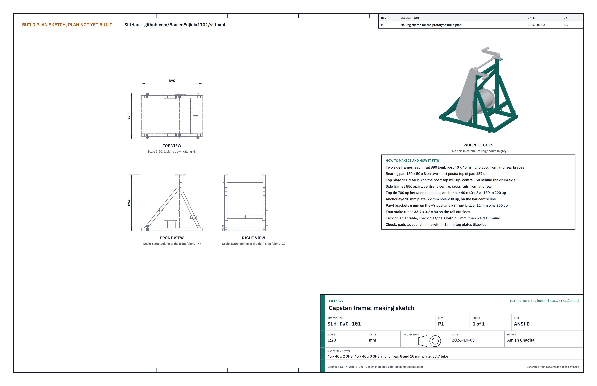

*Figure 2. Capstan frame making sketch (SLH-DWG-101).*

**What it is and what it is made from.** The welded frame that carries the drum, the crank shaft and the anchor. 40 x 40 x 2 mm steel square tube, about 8.2 m; 40 x 40 x 3 mm tube for the anchor bar; 8, 10 and 6 mm plate; 12 mm bar; 33.7 x 3.2 mm tube.

**How to make it.**

1. Cut two side rails 890 long, two cross rails 663 long, two posts 765 long, four pad posts 99 long, the top tie 516 long and the anchor bar 516 long. Cut the braces to fit in step 4.
2. Lay each side rail flat. Weld a post upright 150 mm behind the drum axis line and two pad posts 60 mm each side of the axis line; check square.
3. Weld a bearing pad (180 x 50 x 8) on the two pad posts, its top 157 mm above the floor. Weld a top plate (150 x 60 x 8) on the post, its top 813 mm up.
4. Fit the front brace from 60 mm in from the front end of the rail to the post near 640 mm up, and the rear brace from 50 mm in from the rear end to the post near 560 mm up. Cut the ends to fit and weld.
5. Stand the two side frames 556 mm apart, centre to centre, on a flat floor. Weld in the front and rear cross rails, the top tie between the posts 700 mm up and the anchor bar between the rear braces with its centre 200 mm up.
6. Weld the anchor eye (10 mm plate, 22 mm hole 200 mm up) to the middle of the anchor bar, pointing back.
7. Weld the pawl brackets (6 mm plate) on the +Y side: one on the post and one on the front brace, each with a 12 mm pin standing out, 300 mm up, 115 mm behind and 115 mm in front of the drum axis.
8. Weld a stake tube (33.7 x 3.2 x 80) upright on the outside of each rail end, and two guard tabs on the -Y post at 430 and 700 mm up.
9. Drill the bearing pads for two M14 bolts at 121 mm centres and the top plates for two M12 bolts at 105 mm centres.

**How it fits the parts next to it.** The drum bearings bolt on the pads (Figure 4); the crank bearings bolt on the top plates; the pawls hang on the pins (Figure 8); the sling's shackle goes through the eye (Figure 9).

**Check before moving on.** Diagonals of the base within 3 mm; both pads level and in line within 1 mm; both top plates likewise; the frame weighs about 25 kg.

### 3.2 Winding drum

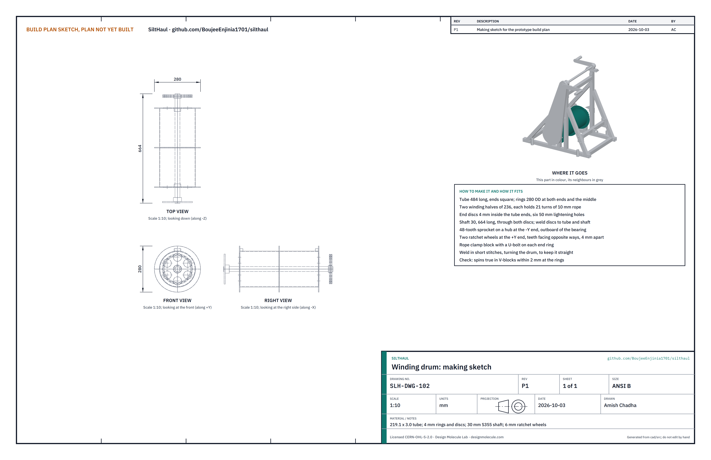

*Figure 3. Winding drum making sketch (SLH-DWG-102).*

**What it is and what it is made from.** The drum that winds the ropes, with the big sprocket and both ratchet wheels on its shaft. 219.1 x 3.0 mm steel tube; 4 mm plate; 30 mm bright steel bar (S355 or EN8); 6 mm plate for the ratchet wheels; the bought 48-tooth sprocket.

**How to make it.**

1. Cut the tube 484 mm long with square ends.
2. Cut two end discs 213 mm across from 4 mm plate with a 30 mm centre hole and six 50 mm lightening holes on a 144 mm circle. Cut three rings 280 mm outside, 219 mm inside, from 4 mm plate.
3. Push the shaft (671 mm long) through both discs; set the discs flush inside the tube ends; check the shaft is central within 0.5 mm; weld the discs to the shaft and the tube in short stitches, turning as you go.
4. Weld a ring at each end and one in the middle; each half between rings is 236 mm, room for 21 turns of rope.
5. At the -Y end, weld the big sprocket to a short hub on the shaft, outboard of where the bearing will sit (Figure 11).
6. At the +Y end, slide on a collar, ratchet wheel 1, a 4 mm spacer and ratchet wheel 2, teeth facing opposite ways as in Figure 8, and weld each to the shaft.
7. Bolt a rope clamp block with a U-bolt to each end ring.

**How it fits the parts next to it.** The shaft runs in the two drum bearings (Figure 4). The pull rope winds from below on the -Y half; the return rope winds from above on the +Y half.

**Check before moving on.** Turned in V-blocks, the rings run true within 2 mm; the sprocket within 1 mm.

### 3.3 Drum bearings (bought)

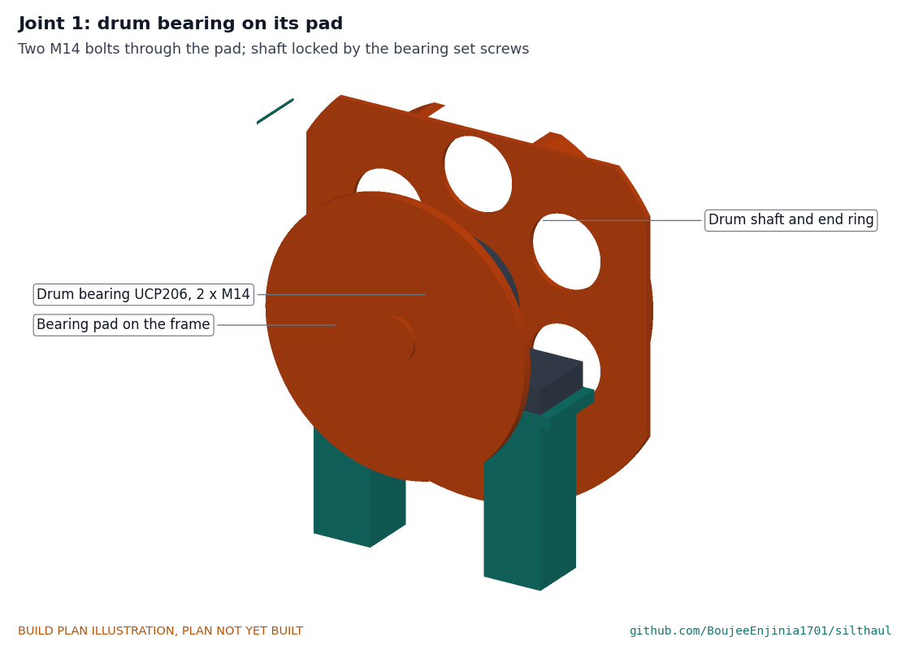

*Figure 4. Joint 1. Each UCP206 bearing bolts to its pad with two M14 bolts; its set screws lock the shaft.*

Buy two UCP206 pillow block bearings with 30 mm bores. Nothing to make.

### 3.4 Pawls

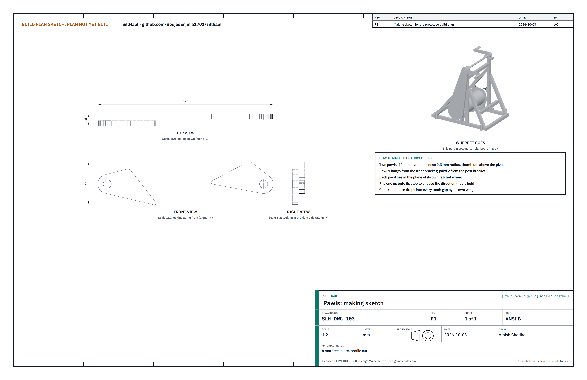

*Figure 5. Pawls making sketch (SLH-DWG-103).*

**What it is and what it is made from.** Two pawls that stop the drum turning back, one for each direction. 8 mm steel plate, profile cut.

**How to make it.** Cut both from the sketch: a 12 mm pivot hole, a nose with a 2.5 mm radius 85 mm from the drum axis when hanging, and a thumb tab. Deburr; the nose edge stays square.

**How it fits the parts next to it.** Each hangs on its pin in the plane of its own ratchet wheel, held by a washer and an R-clip (Figure 8). To choose the direction held, flip the other pawl up onto its stop.

**Check before moving on.** Each falls into every tooth gap by its own weight as the drum is turned slowly.

### 3.5 Crank shaft, sprocket hub and cranks

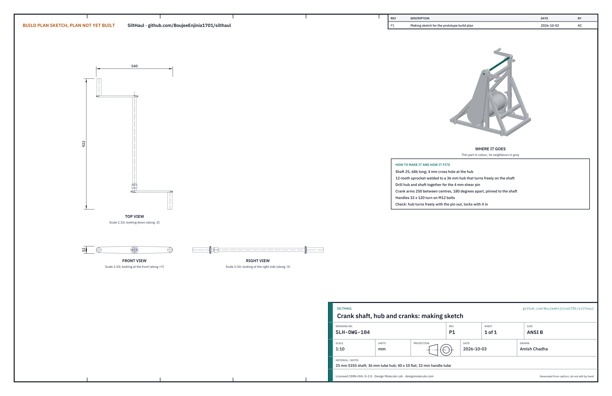

*Figure 6. Crank shaft, hub and cranks making sketch (SLH-DWG-104).*

**What it is and what it is made from.** The shaft the people turn, and the hub that drives the chain through the shear pin. 25 mm bright steel bar; 36 mm tube for the hub; the bought 12-tooth sprocket; 40 x 10 mm flat bar; 32 mm tube; M12 bolts.

**How to make it.**

1. Cut the shaft 689 mm long.
2. Cut the hub 25 mm long from 36 mm tube bored to slide on the shaft; weld the 12-tooth sprocket to its outer end.
3. Slide the hub on the shaft at the -Y end, clamp, and drill a 4 mm hole through hub and shaft together, square to the shaft.
4. Make two crank arms 250 mm between hole centres; bore one end for the shaft and drill the other for an M12 handle bolt. Pin each arm to the shaft with a 6 mm roll pin, the two arms 180 degrees apart.
5. Fit a 32 mm handle tube, 120 long, on each M12 bolt so it turns freely.

**How it fits the parts next to it.**

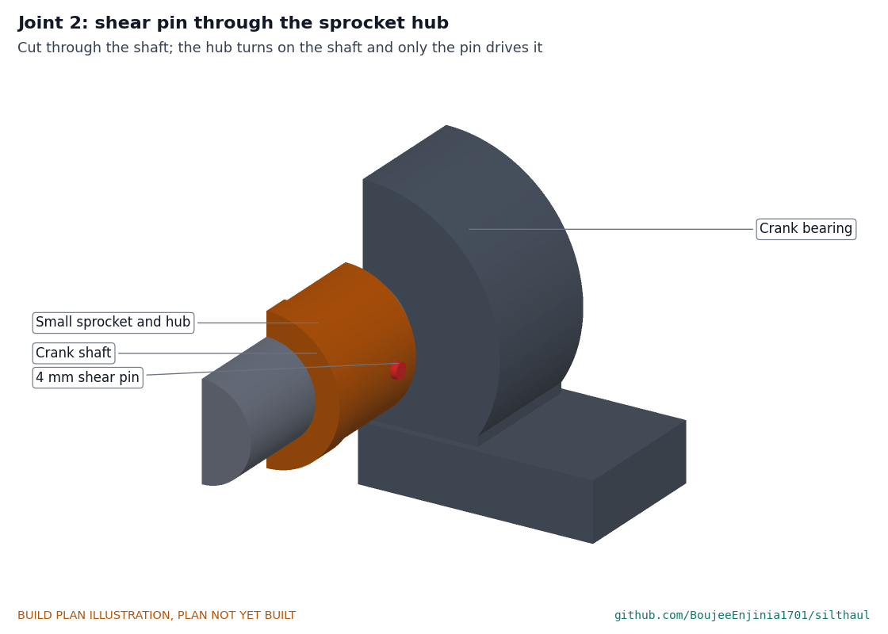

*Figure 7. Joint 2. The hub turns freely on the shaft; only the 4 mm pin passes the drive. If the rope tension passes about 2.5 kN, the pin shears and the cranks spin free while a pawl holds the drum.*

**Check before moving on.** With the pin out the hub turns freely by hand; with it in, it does not move.

### 3.6 Ratchet wheels and pawls together

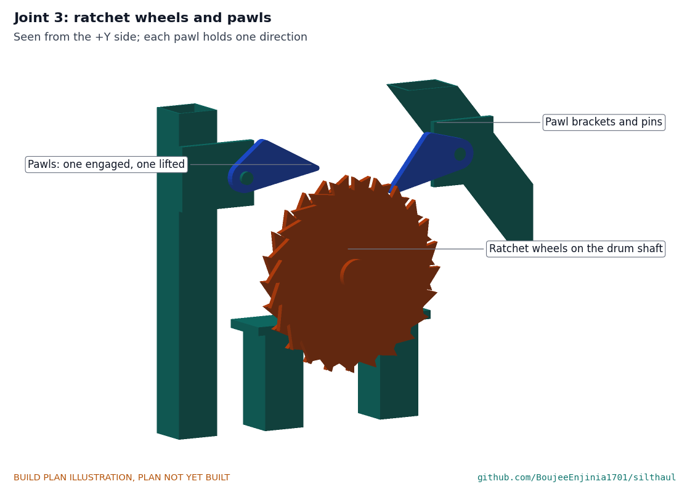

*Figure 8. Joint 3. The two ratchet wheels face opposite ways; the pawl in front holds one, the pawl behind holds the other. Here one is down and one is lifted.*

### 3.7 Anchor eye and sling

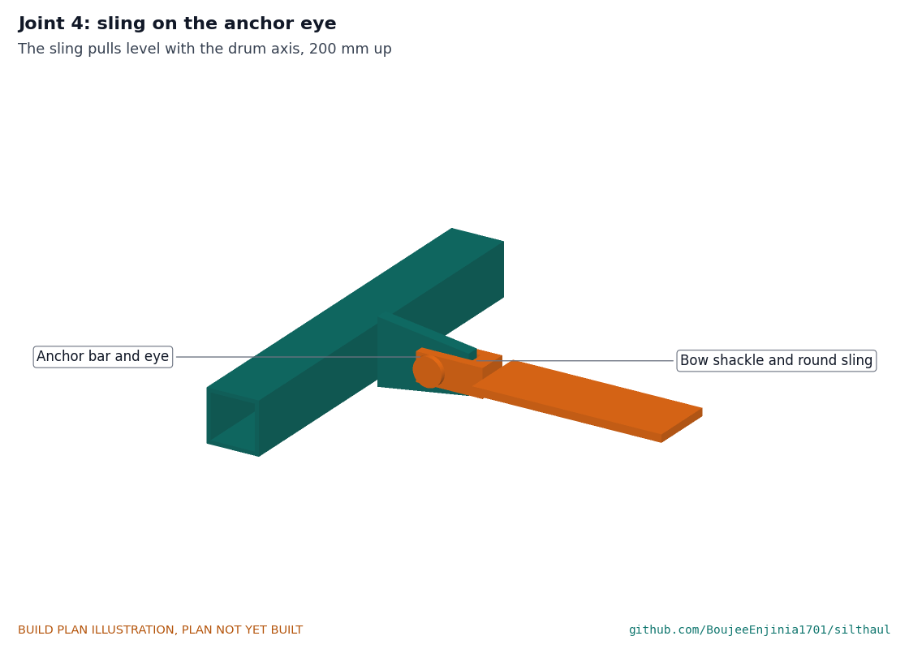

*Figure 9. Joint 4. The bow shackle's 19 mm pin goes through the 22 mm hole in the eye; the round sling sits in the bow. The pull is 200 mm up, in line with the ropes.*

### 3.8 Chain guard

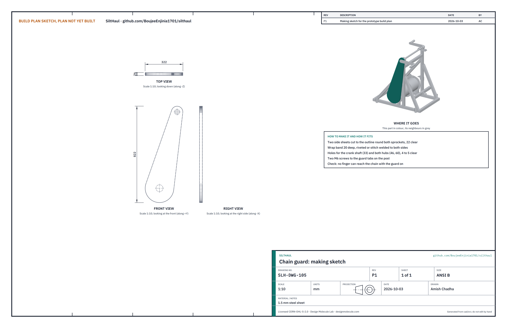

*Figure 10. Chain guard making sketch (SLH-DWG-105).*

**What it is and what it is made from.** A closed box round the chain and both sprockets. 1.5 mm steel sheet.

**How to make it.**

1. Mark both side sheets from the sketch: the outline round both sprockets with 22 mm clearance.
2. Cut the holes in the inner sheet for both hubs and in the outer sheet for the crank shaft, each 4 to 5 mm clear.
3. Bend a band 20 mm wide round the outline and stitch weld or rivet both sheets to it.
4. Drill for two M6 screws to match the guard tabs.

**How it fits the parts next to it.**

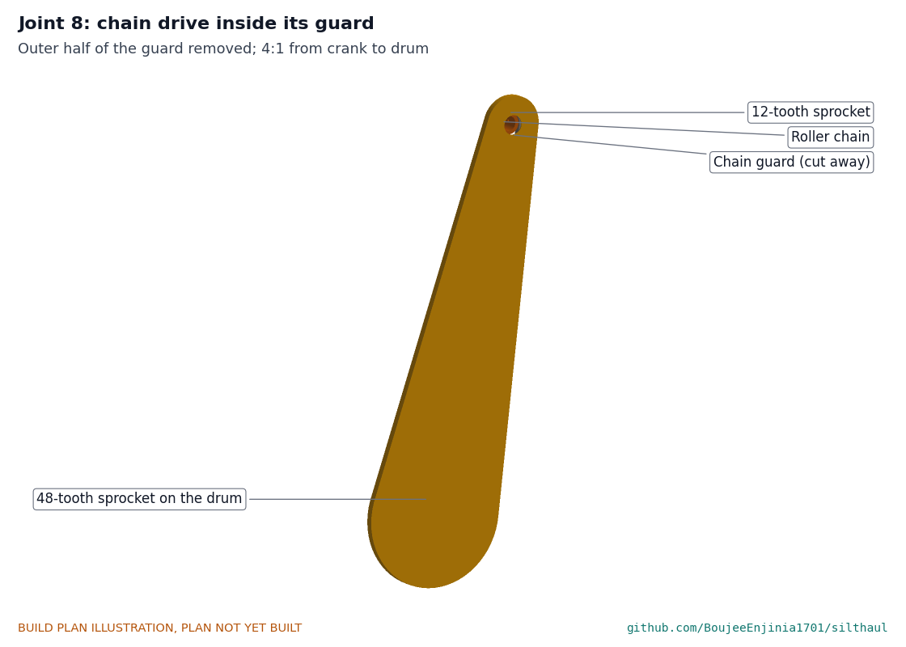

*Figure 11. Joint 8, outer half of the guard removed. The chain runs 4:1 from the small sprocket on the crank shaft to the big sprocket on the drum.*

**Check before moving on.** With the guard on, a finger cannot reach the chain or sprockets through any gap.

### 3.9 Ground stakes (make 4)

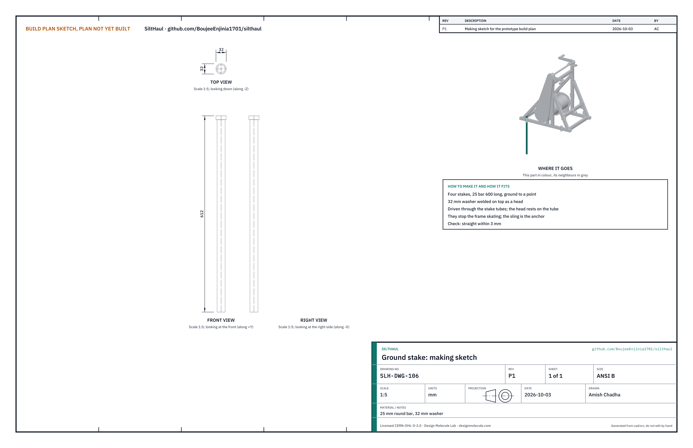

*Figure 12. Ground stake making sketch (SLH-DWG-106).*

**What it is and what it is made from.** Pins that stop the capstan skating sideways. 25 mm round bar 600 long; a 32 mm washer.

**How to make it.** Grind one end to a point; weld the washer on the other end as a head.

**How it fits the parts next to it.** Each is driven through a stake tube until its head rests on the tube. The stakes are not the anchor; the sling is.

**Check before moving on.** Straight within 3 mm.

### 3.10 Scraper box and tipping bar

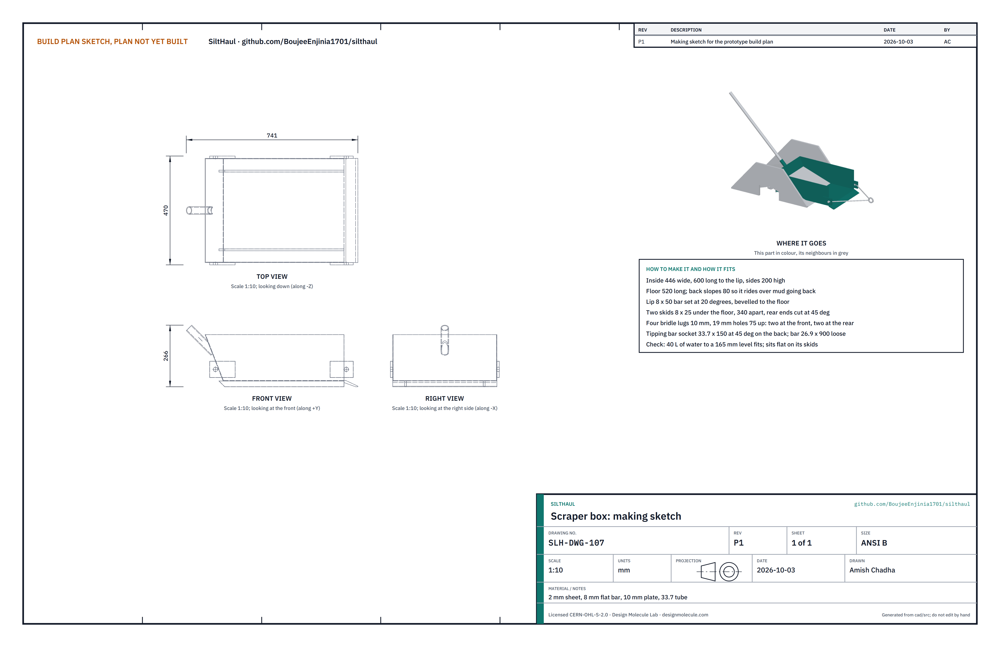

*Figure 13. Scraper box making sketch (SLH-DWG-107).*

**What it is and what it is made from.** The box that carries the mud. 2 mm steel sheet; 8 x 50 and 8 x 25 mm flat bar; 10 mm plate; 33.7 x 3.2 mm tube; a 26.9 x 2.6 mm tube 900 long for the tipping bar.

**How to make it.**

1. Cut the floor 520 x 446, the sloped back 216 x 446 and two sides with a sloping rear edge (600 long at the floor line plus the 80 mm slope, 200 high).
2. Tack the floor, back and sides together on a flat table; the back leans out 80 mm over its 200 mm height; weld inside and out.
3. Weld the two skids (8 x 25 bar) under the floor, 340 mm apart, their rear ends cut at 45 degrees.
4. Weld the lip (8 x 50 bar, the full width) to the front of the floor at about 20 degrees down, and grind its front edge to a bevel that touches the ground.
5. Weld two bridle lugs (10 mm plate, 19 mm hole 75 mm up) on the outside of each side: at the front, the hole 10 mm ahead of the lip line; at the rear, the hole 45 mm from the back.
6. Weld the socket tube (150 long) to the middle of the back, pointing up and back at 45 degrees.
7. Cap both ends of the tipping bar.

**How it fits the parts next to it.**

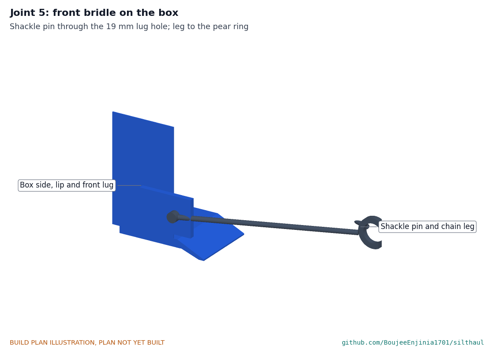

*Figure 14. Joint 5. A bow shackle's pin goes through each front lug; a leg of 8 mm chain runs from each shackle to a pear ring 300 mm ahead. The rear bridle is the same, behind the box.*

**Check before moving on.** 40 L of water poured in comes to about 165 mm deep (cover the open front with a board); the box sits flat on its skids.

### 3.11 Tail plate, pins and keeper

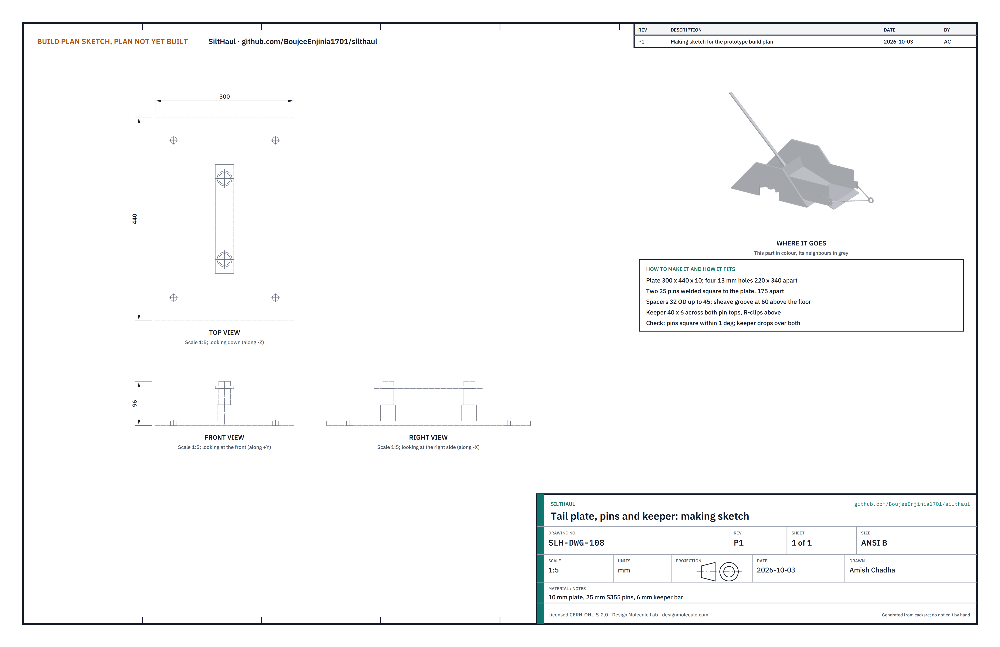

*Figure 15. Tail plate, pins and keeper making sketch (SLH-DWG-108).*

**What it is and what it is made from.** The block at the far end of the room that turns the rope back. 10 mm plate 300 x 440; 25 mm bright steel bar (S355); 32 mm tube; 6 x 40 mm flat bar.

**How to make it.**

1. Cut the plate; drill four 13 mm anchor holes at the corners of a 220 x 340 rectangle.
2. Drill two 25 mm holes on the plate's centre line across, 175 mm apart; push in the pins (85 mm long), check square, and weld above and below.
3. Cut two spacers 35 mm long from 32 mm tube.
4. Cut the keeper bar 255 long, drill two 25 mm holes 175 apart, and drill each pin top for an R-clip.

**How it fits the parts next to it.**

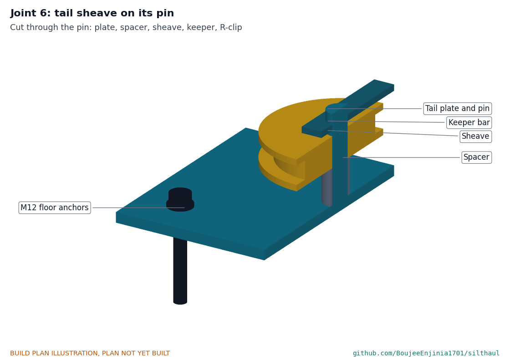

*Figure 16. Joint 6, cut through a pin. Plate, spacer, sheave, keeper bar and R-clip stack on the pin; the rope groove sits 60 mm above the floor. M12 anchors pass through the plate into the slab.*

**Check before moving on.** Pins square within 1 degree; the keeper drops over both pins; each sheave turns freely.

### 3.12 Doorway ramp

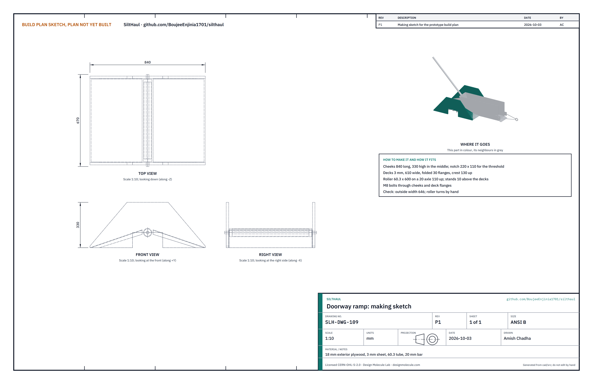

*Figure 17. Doorway ramp making sketch (SLH-DWG-109).*

**What it is and what it is made from.** A ramp that carries the box and both ropes over the threshold and keeps the ropes off the door frame. 18 mm exterior plywood; 3 mm steel sheet; 60.3 x 3.6 mm tube; 20 mm bar; two nylon bushes; M8 bolts.

**How to make it.**

1. Cut two cheeks from plywood: 840 long, rising to 330 high over the middle 300, with a notch 220 wide and 110 high underneath for the threshold. Drill a 21 mm hole 110 mm up at the middle.
2. Cut and fold two deck trays from 3 mm sheet: 610 wide, each running from the floor to 130 mm up over 380 mm, with 30 mm flanges turned down each side.
3. Cut the roller 600 long; press a nylon bush into each end.
4. Bolt the flanges through the cheeks with M8 bolts; the deck tops meet the floor in a thin edge and stop 40 mm short of the middle.
5. Push the axle through one cheek, the roller and the other cheek; R-clip both ends.

**How it fits the parts next to it.**

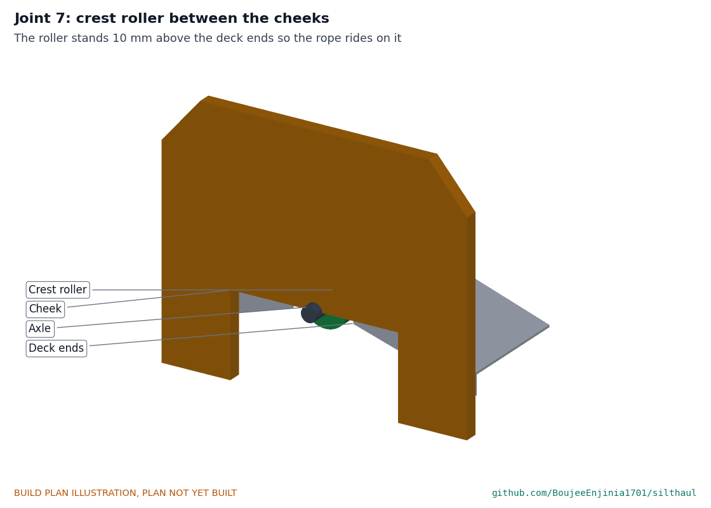

*Figure 18. Joint 7. The roller stands 10 mm above the deck ends, so the ropes and the box ride over it rather than over the edges.*

**Check before moving on.** 646 mm outside; the roller turns by hand; the ramp sits flat over a 110 mm threshold.

### 3.13 Bought components

Buy to specification, not brand. Line numbers are those of the bill of materials.

- **Bearings (lines 3 and 4).** Two UCP206 (30 mm) and two UCP205 (25 mm) pillow block ball bearings.
- **Sprockets and chain (lines 6 and 7).** ISO 08B-1 (12.7 mm pitch): a 12-tooth sprocket bored to suit the hub and a 48-tooth plate wheel bored 30 mm; 1.75 m of chain with breaking load at least 17.8 kN and one connecting link.
- **Shear pins (line 10).** 4 mm S235 mild steel bar cut 44 mm long, with split pins; never hardened steel.
- **Sling and shackles (lines 12 and 20).** A 3 m polyester round sling, WLL 2,000 kg; six bow shackles WLL 1,000 kg with 19 mm pins; a tree protector strap; 2.4 m of 8 mm grade 30 chain; two 56 mm pear rings.
- **Tail sheaves (line 14).** Two steel sheaves, 125 mm pitch diameter for 10 to 12 mm fibre rope, 25 mm bore, rated at least 1,000 kg.
- **Floor anchors (line 15).** M12 wedge anchors for sound concrete, 80 mm embedment; ten, so six are spare.
- **Rope (line 16).** 55 m of 10 mm polyester double braid, minimum breaking strength at least 18 kN, cut into a 17 m pull rope and a 38 m return rope, each with an eye splice at both ends.
- **Fasteners and consumables (lines 21 and 23).** Four M14 x 50 and four M12 x 45 bolts for the bearings, M6 screws, M8 bolts for the ramp, R-clips; primer, paint, welding wire and discs.
- **Stop signal and briefing card (line 22).** A laminated card with the hand signals and stop rule, two whistles and two armbands.

## 4. Putting it together

In each picture the parts already fitted are grey and the part being fitted is in colour, with an arrow showing the way it goes in. Steps 1 to 8 are done in the workshop; steps 9 to 12 on site. Two people throughout.

### Step 1: drum bearings onto the drum shaft

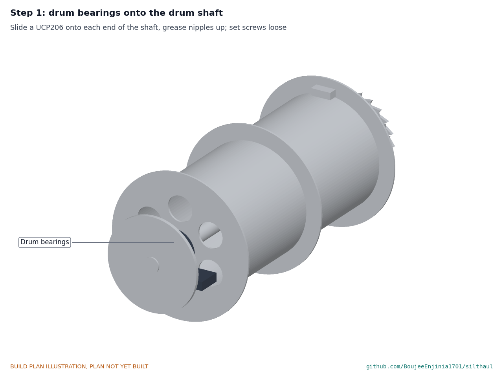

Slide a UCP206 bearing onto each end of the drum shaft, grease nipple up, set screws loose. The drum lifts with its bearings: 23 kg.

### Step 2: lower the drum onto the pads

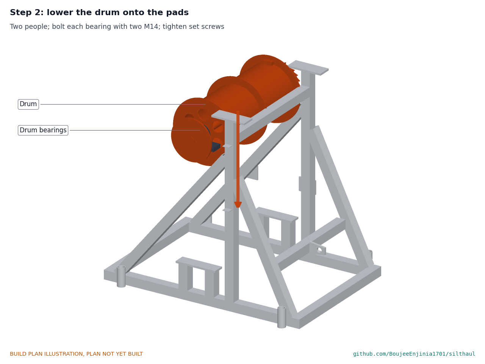

Two people lower the drum and bearings onto the pads, sprocket to the -Y side. Bolt each bearing with two M14 bolts; centre the drum between the frame sides; tighten the set screws.

### Step 3: crank shaft, hub and bearings onto the top plates

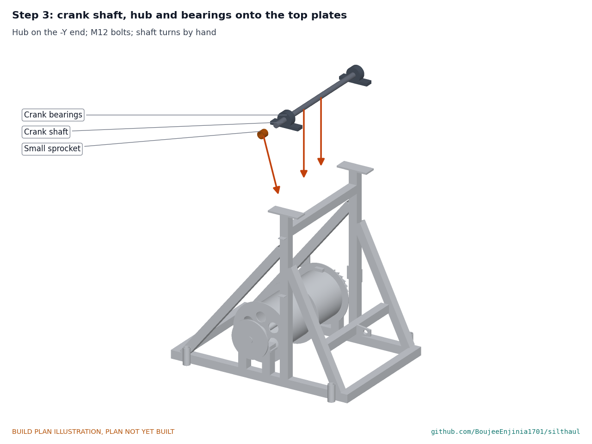

Slide the crank bearings onto the crank shaft, with the sprocket hub on the -Y end. Bolt the bearings to the top plates with M12 bolts, the small sprocket in line with the big one within 1 mm.

### Step 4: fit the chain

Lay the chain over both sprockets and join it with the connecting link, the clip's closed end leading in the haul direction. The chain should lift about 10 mm at mid-span by hand.

### Step 5: fit the shear pin

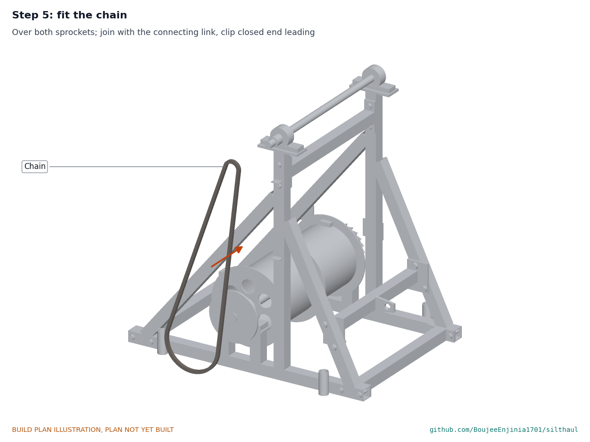

Push a 4 mm shear pin through the hub and shaft and fit its split pin. Hang the spares on the tag chain at the capstan.

### Step 6: chain guard on

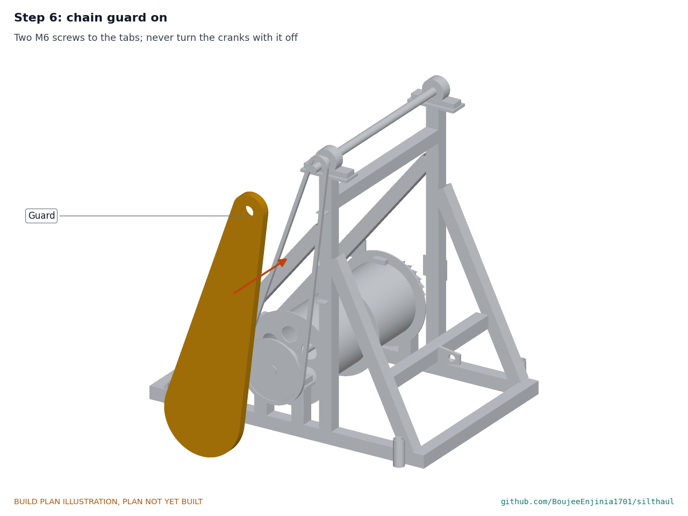

Fit the guard over the chain and fix it with two M6 screws to the tabs. From now on, the cranks are never turned with it off.

### Step 7: cranks on

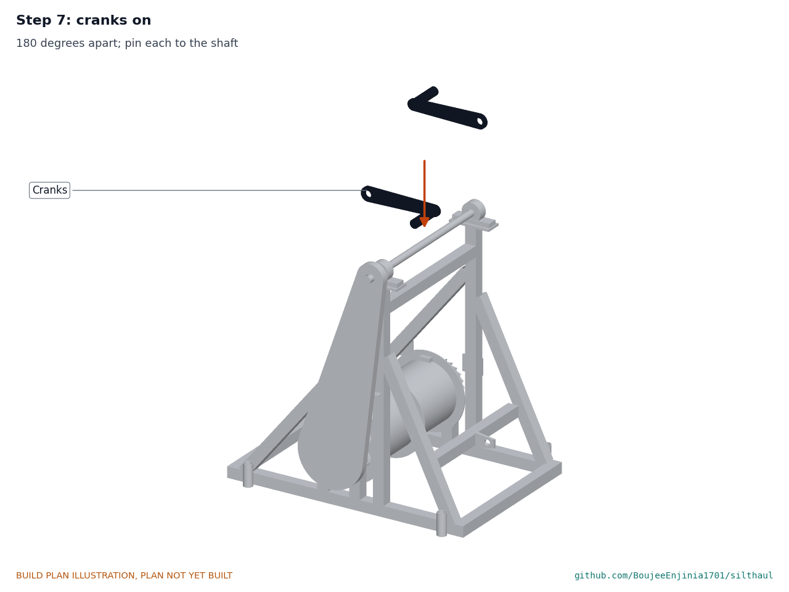

Fit a crank arm to each end of the crank shaft, 180 degrees apart, and roll-pin each.

### Step 8: pawls on their pins

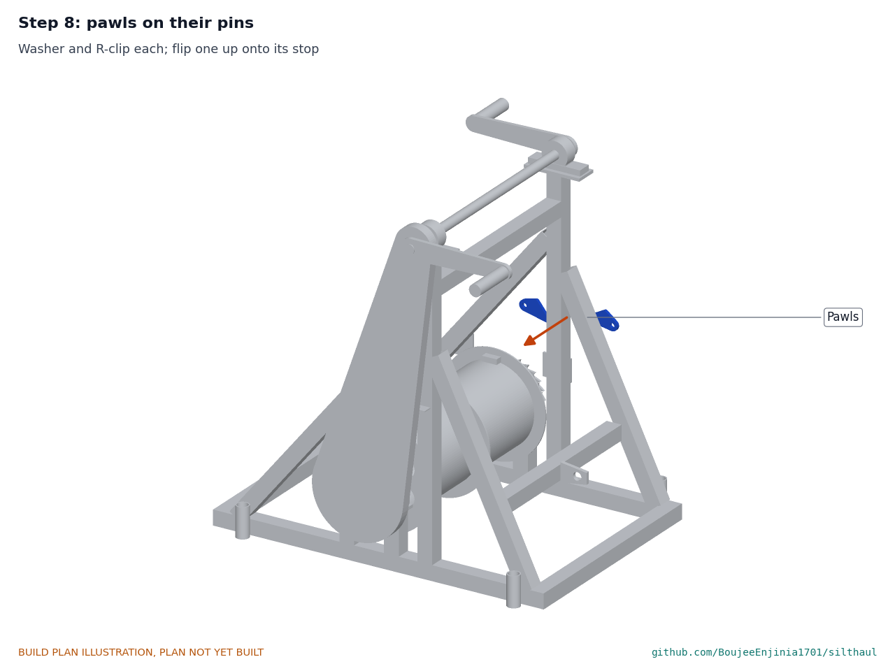

Hang each pawl on its pin with a washer and an R-clip. Flip one up onto its stop.

### Step 9: set the capstan, stakes and sling

On site, carry the frame and the drum separately and reassemble (steps 2, 4 to 6). Set the capstan on firm level ground at least 6 m beyond the door, its drum square to the line from the tail block through the door. Drive the four stakes. Wrap the sling round a sound tree, low on the trunk with the protector, or a parked vehicle's recovery point; shackle it to the eye so it runs level or rises 10 degrees at most.

### Step 10: anchor the tail block

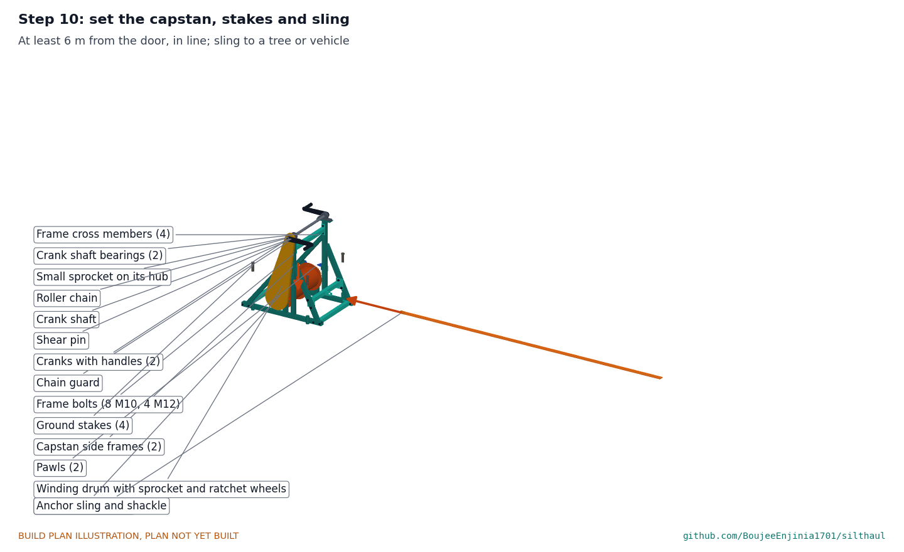

At the far end of the room, on the line through the door, check the slab (section 6). Drill four 12 mm holes 80 mm deep through the plate holes, clean them, fit the M12 anchors and tighten to the maker's torque. Stack spacers, sheaves and keeper on the pins; R-clip.

### Step 11: ramp across the threshold

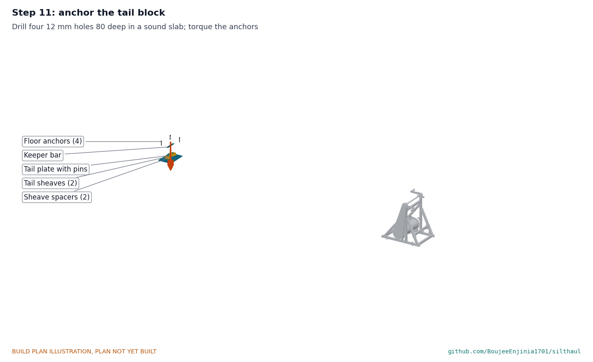

Stand the ramp in the doorway with its cheeks straddling the threshold and the roller square to the rope line.

### Step 12: reeve the ropes and shackle the box

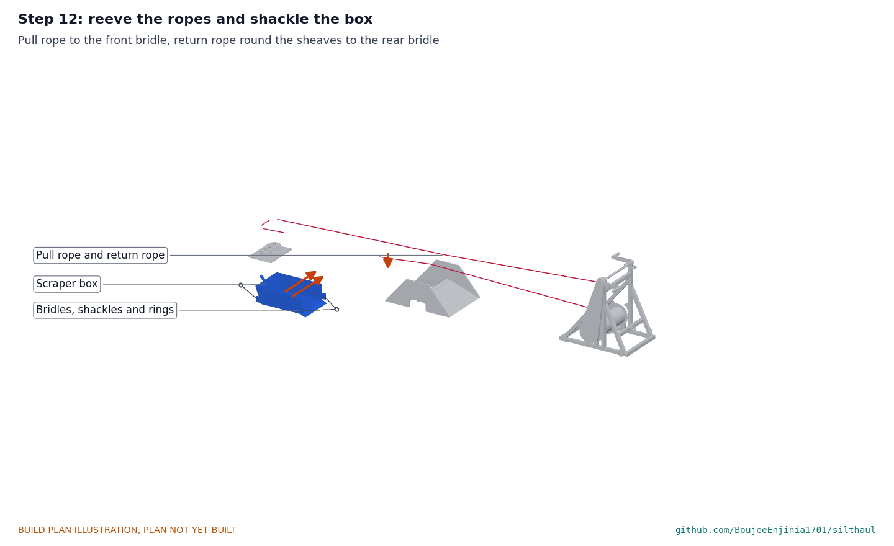

Clamp the pull rope's end to the drum's -Y half, wind on three turns from below, run it over the ramp roller and shackle it to the front bridle ring. Clamp the return rope's end to the +Y half, wind on the turns for the box's distance from the tail block plus three from above, run it over the roller, beside the box, round both tail sheaves and back to the rear bridle ring. Take up the slack with the cranks until both ropes are just off the floor.

## 5. First checks

These are listed here and recorded in a TRL 4 test report, not in this plan.

*Table 2. First checks.*

| Check | Requirement | How | Pass when |
| --- | --- | --- | --- |
| Fit through the door | R4 | Carry the box, tail block and ramp through a 0.7 m opening; run the box over the ramp with the return rope beside it | Nothing touches the door frame |
| Holding | R12 | At working pull, let go of the cranks in each direction | The drum stops within one tooth; cranks do not kick back past a quarter turn |
| Shear pin release | R11 | Pull the box against a fixed stop through a load cell, cranking slowly | The pin shears between 1,960 and 2,940 N; a pawl holds the drum |
| Proof load of anchors | R6, R7 | CalRig or a load cell, held 1 min: tail block to 9.0 kN (both legs at 1.5 times 3,000 N), capstan sling and frame to 4.9 kN | No movement over 2 mm, no damage |
| Crank force | R2 | Spring balance on a handle with a full box | 150 N or less per person with two cranking |
| Box capacity | R3 | Fill with 40 L of water, front boarded | Level about 165 mm |
| Haul trial | R1, R5 | Full length, timed against a bucket crew | Record both rates |
| Setup | R8 | Three people, timed | 20 min or less |
| Mass and packing | R9 | Weigh each lift; pack the kit | Each 25 kg or less; record the vehicle needed |

## 6. Safety stops

Work stops at each of these points until what is listed is true.

1. **Before any rope is put under load.** The building has been checked for structural damage and the electricity is off. The chain guard is on. A pawl is down. Everyone has been briefed with the card: one signaller, whistle and hand signals; one blast stops the cranks.
2. **Before fitting the tail block.** The slab has been drilled and is sound concrete at least 100 mm thick, with no hollow sound under tiles and no cracks within 150 mm of a hole. If not, SiltHaul is not used in that room.
3. **Before the first haul on a site.** Every anchor has been proof-loaded for 1 min at 1.5 times its load at the 3,000 N limit: the tail block to 9.0 kN and the capstan sling and frame to 4.9 kN with nobody in the rope lines. The rope, splices, shackles and sling have been inspected that day.
4. **Before each haul.** Nobody is inside the loop, in the line of a rope, beside a sheave or within 2 m of the ramp. Loaders stand to the side away from the return rope.
5. **Before dumping.** The cranks are stopped and a pawl is holding. Two people lift the tipping bar; nobody stands in front of the lip.
6. **After a shear pin breaks.** Stop, find the jam with the rope slack, clear it, then fit a new pin of the same 4 mm S235 bar. Never a bolt, a nail or a harder pin.
7. **At the end of each day.** Inspect the rope for cuts and glazing, the splices, the shackles, the pawls and the anchors; replace anything damaged.

## 7. Tools, skills and workspace

- MIG welder (or a small stick welder with 2.5 mm electrodes) and a person who can weld 2 mm tube without burning through; welding screen, gloves and mask.
- Angle grinder with cutting and grinding discs; metal saw; pillar drill with bits to 25 mm; hammer drill with a 12 mm masonry bit for site.
- Jigsaw for the plywood; bending brake or a vice and hammer for the 1.5 and 3 mm sheet.
- Spanners to M14, torque wrench, R-clip pliers, splicing fid if the eye splices are made in-house.
- A flat floor or welding table about 1.0 x 1.0 m; two people for the drum and frame.
- Rope work: eye splices in double braid made by a rigger or a trained person.

## 8. Where the numbers come from

- `cad/src/model.py`: the parametric model, its constructability checks and the STEP and STL files in `cad/step` and `cad/stl`.
- `cad/drawings/SLH-DWG-001` and `SLH-DWG-002`: general arrangement of the capstan and the system layout; `SLH-DWG-101` to `SLH-DWG-109`: making sketches.
- `docs/04-calcs/01-sizing.md` and `docs/04-calcs/sizing.py` (SLH-CAL-001): loads, forces, strengths and masses.
- `bom/bom.csv`: parts, specifications and prices.
- `docs/decisions/0002-design-for-construction.md` (SLH-DDR-002): the changes in section 2.
- `cad/src/build_plan_media.py`: every picture in this plan.
